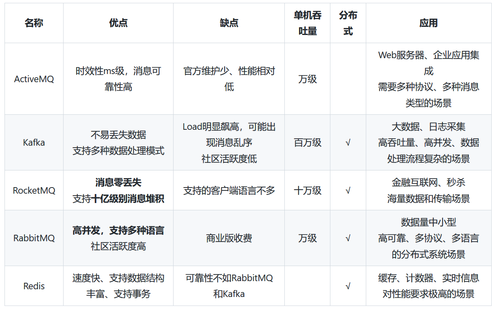
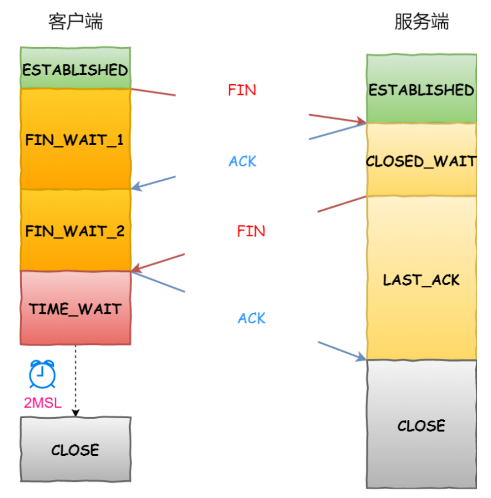

# Java基础


## **1. 什么是字节码？采用字节码的最大好处是什么？**

回答来自：编程导航官方、JavaGuide

>字节码是 Java 程序编译后的中间代码，是一种可移植的二进制代码，可以在任何支持 Java 虚拟机（JVM）的平台上运行。**字节码通过将 Java 源代码编译为字节码指令序列，使得 Java 程序可以跨平台运行**，即使是在不同的操作系统和硬件平台上也可以运行。
>
>字节码采用中间代码的形式，相比于直接将程序编译为特定平台上的机器码，有以下几个好处：
>
>1. **可移植性**：由于字节码是中间代码，所以可以在任何支持 JVM 的平台上运行，使得 Java 程序具有很好的可移植性。这也是 Java 跨平台的重要特性之一。
>2. **安全性**：由于字节码需要在 JVM 中运行，所以可以对字节码进行安全检查，以确保程序不会对系统造成威胁。
>3. **性能**：由于字节码是一种紧凑的二进制格式，相比于直接编译为机器码，可以更快地加载和传输，同时也可以在运行时进行动态优化，提高程序的执行效率。
>4. **可读性**：相比于直接编译为机器码，字节码具有更好的可读性，可以方便地进行反汇编和调试。
>
>因此，采用字节码作为中间代码的最大好处是提高了 Java 程序的可移植性、安全性、性能和可读性。这也是 **Java 跨平台和安全性等特性的基础。**
>
>


## **2. JDK 和 JRE 和 JVM 分别是什么，有什么区别？**

来自：编程导航官方

> 1. **JDK（Java Development Kit）**：JDK 是 Java 开发工具包，包含了**编写、编译、调试和运行 Java 程序所需的所有工具和组件**，比如编译器（javac）、Java API、调试工具等。JDK 是针对 Java 开发人员的，它包含了 JRE，还有编译器和其他工具，可以用来编写和调试 Java 程序。
> 2. **JRE（Java Runtime Environment）**：JRE 是 Java 运行时环境，**包括了 Java 虚拟机（JVM）和 Java 标准类库（Java API）**。JRE 是针对 Java 应用程序的，它提供了在计算机上运行 Java 应用程序所需的**最小环境**。
> 3. **JVM（Java Virtual Machine）**：JVM 是 Java 虚拟机，是 Java 程序运行的环境。**JVM 负责将 Java 代码解释或编译为本地机器代码，并在运行时提供必要的环境支持**，比如内存管理、垃圾回收、安全性等。JVM 的主要作用是将 Java 代码转换为可以在计算机上运行的机器码，并负责程序的执行。
>
> **综上所述**，JDK、JRE 和 JVM 之间的区别可以总结如下：
>
> - JDK 是 Java 开发工具包，包括了编译器、Java API、调试工具等，用于开发 Java 应用程序。
> - JRE 是 Java 运行时环境，包括了 Java 虚拟机和 Java 标准类库，用于在计算机上运行 Java 应用程序。
> - JVM 是 Java 虚拟机，是 Java 程序运行的环境，负责将 Java 代码转换为可以在计算机上运行的机器码，并提供必要的环境支持。


## **3. Java 和 C++、Go 语言的区别，各自的优缺点？**

来自：编程导航官方

> Java、C++ 和 Go 都是流行的编程语言，它们各自有着自己的特点和优缺点。
>
> Java 是一种面向对象的编程语言，最初被设计用于开发嵌入式系统，现在已广泛`应用于企业应用、Web 应用和移动应用开发等领域`。Java 的优点包括：
>
> - **跨平台性强**：Java 虚拟机（JVM）可以在不同的操作系统上运行 Java 程序，使得开发者可以编写一次代码并在多个平台上运行；
> - **安全性高**：Java 有很多安全特性，例如自动内存管理、类的访问权限控制、异常处理等，可以有效避免一些常见的安全漏洞；
> - **生态系统完备**：Java 的生态系统非常完善，有很多成熟的框架和工具可以帮助开发者快速构建复杂的应用。
>
> 
>
> C++ 是一种系统级编程语言，最初被设计用于操作系统和系统软件的开发，现在也广泛`应用于游戏、图形图像处理、嵌入式系统等领域`。C++ 的优点包括：
>
> - **性能高**：C++ 是一种编译型语言，可以生成高效的机器代码，所以在处理大量数据和对计算效率有要求的应用场景下具有优势；
> - **控制能力强**：C++ 具有非常高的控制能力，可以直接操作计算机的硬件和内存等资源；
> - **应用领域广泛**：C++ 适用于开发大型系统、高性能应用和底层软件，如操作系统、数据库、游戏引擎等。
>
> 
>
> Go 是一种开源的编程语言，由 Google 公司开发，被设计`用于开发高并发、分布式系统`。Go 的优点包括：
>
> - **并发能力强**：Go 具有轻量级的线程（goroutine）和基于消息传递的通道（channel），可以方便地实现并发编程；
> - **内存管理高效**：Go 的内存管理采用自动垃圾回收机制，使得开发者可以更加专注于业务逻辑；
> - **语言特性简单**：Go 的语法简单易懂，代码易于阅读和维护，同时提供了丰富的标准库和工具支持。
>
> 
>
> 不同的编程语言适用于不同的应用场景，开发者可以根据项目的需求、自己的经验和偏好选择合适的语言。


## **4. JDK 动态代理和 CGLIB 动态代理的区别是什么？**

来自：解州扯面

> **1、JDK动态代理具体实现原理：**
>
> **JDK动态代理是面向接口的代理模式**
>
> 代理类有一个静态方法`Proxy.newProxyInstance(classLoader, interfaces, invocationHandler)`
>
> 通过实现 `InvocationHandler` 接口，重写`invoke`方法，实现业务增强操作；
>
> **JDK动态代理是面向接口的代理模式**，如果被代理目标没有接口那么Spring也无能为力，Spring通过Java的反射机制生产被代理接口的新的匿名实现类，重写了其中AOP的增强方法。
>
> 
>
> **2、CGLib动态代理：**
>
> CGLib的核心原理是通过**修改字节码生成目标类的子类，然后使用这个子类作为代理对象**。
>
> 
>
> **3、两者对比：**
>
> JDK动态代理是**面向接口**的。
>
> CGLib动态代理是**通过字节码底层继承目标类来实现**，因此如果**目标类被final关键字所修饰，会失败。**
>
> 
>
> **如果目标对象实现了接口，那么Spring会使用JDK动态代理来完成操作**（Spirng默认采用JDK动态代理实现机制）；
>
> **如果目标对象没有实现接口，那么Spring会强制使用CGLib来实现动态代理。**


## **5. Java 中 final 关键字有什么用？**

来自：编程导航官方

> 在 Java 中，final 关键字用于表示**不可变**。
>
> 在 Java 中，final 关键字可以修饰类、方法和变量，作用如下：
>
> 1. **final 修饰类**，表示该类`不能被继承`。final 类中的方法默认都是 final 的，不能被子类重写。
> 2. **final 修饰方法**，表示该方法`不能被子类重写`。
> 3. **final 修饰变量**，表示该变量`只能被赋值一次`。final 修饰的变量必须在声明时或构造函数中初始化，且不能再被修改。常用于定义常量。
>
> 另外，使用 final 修饰的变量在编译时就已经确定了其值，因此在运行时访问时比非 final 变量更快。
>
> 使用 final 关键字可以带来一些好处，例如：
>
> 1. **安全性**：将变量声明为 final 可以防止它被改变，从而提高安全性。
> 2. **可读性**：将常量声明为 final 可以提高代码的可读性，因为常量的值不会被修改。
> 3. **优化**：final 变量在编译时被转换成常量，这可以提高程序的性能。
>
> 总之，final 关键字在 Java 中非常有用，可以提高程序的**安全性、可读性和性能**。


## **6. Java 中 hashCode 和 equals 方法是什么？它们和 == 各有什么区别？**

来自：编程导航官方、JavaGuide

> 在 Java 中，hashCode 和 equals 方法都是 Object 类的方法。它们的作用分别如下：
>
> - hashCode 方法返回对象的哈希码，**用于支持基于哈希表的集合**，如 HashMap、HashSet 等。通过hashCode方法计算出对象的哈希码，哈希码相同的对象分为一组，然后通过重写后的equals方法，判断该对象内容是否与已存在对象内容相同，若相同，返回true
> - equals 方法用于比较对象是否相等。**默认情况下，equals 方法使用的是 == 操作符**，即**只有两个对象引用指向同一个对象时才会返回 true**。但是，大部分情况下，我们需要重写 equals 方法来实现自己定义的相等规则。
>
> hashCode 方法用于快速比较两个对象是否不同，因为**如果它们的哈希码不同，那么它们肯定不相等。**hashCode 可能会出现 hash 碰撞，所以导致**不相等的两个对象 hash 码可能相等**，
>
> equals 方法则用于判断两个对象是否真正相等，需要根据对象的实际情况来定义。
>
> 另外，需要注意的是，`==` 操作符用于比较两个对象的引用是否相等，即它们是否指向同一个对象。而 equals 方法则用于比较两个对象的值是否相等。
>
> 在 Java 中，对象的值比较往往需要根据对象的实际情况来定义，因此一般需要重写 equals 方法。
>
> 
>
> **== 和 equals() 的区别**
>
> **`==`** 对于基本类型和引用类型的作用效果是不同的：
>
> - 对于基本数据类型来说，`==` 比较的是值。
> - 对于引用数据类型来说，`==` 比较的是对象的内存地址。
>
> > 因为 Java 只有值传递，所以，对于 == 来说，不管是比较基本数据类型，还是引用数据类型的变量，其本质比较的都是值，只是引用类型变量存的值是对象的地址。
>
> **`equals()`** 不能用于判断基本数据类型的变量，只能用来判断两个对象是否相等。`equals()`方法存在于`Object`类中，而`Object`类是所有类的直接或间接父类，因此所有的类都有`equals()`方法。
>
> 
>
> **总结** ：
>
> - `equals` 方法判断两个对象是相等的，那这两个对象的 `hashCode` 值也要相等。
> - 两个对象有相同的 `hashCode` 值，他们也不一定是相等的（哈希碰撞）。


## 7.Java浅拷贝与深拷贝

来自：沉默王二

```java
public class MyClass implements Cloneable {
    private int num;
    private MyObject obj;

    @Override
    public Object clone() throws CloneNotSupportedException {
        return super.clone();
    }
}
MyClass copy = (MyClass) original.clone();
```

> 浅拷贝：拷贝一个对象的属性值，对于基本数据类型来说就是值本身，对于引用数据类型来说就是引用值，目标对象修改引用属性的值话，源对象的引用属性也会变。`copy`和`original`引用值不同，但是他们的`obj`引用值相同
>
> 深拷贝：对于引用类型的字段，需要同样进行深拷贝。`copy`和`original`引用值不同，他们的`obj`字段引用值**也不同**。利用对象的序列化和反序列化实现了深拷贝，写入流中的对象就是对原始对象的拷贝。
>
> 总结：
>
> - 如果被拷贝的类中包含不可变对象（String）或者基本类型字段，则无需进行深拷贝，因为它们的值本身就是不可变的。
> - 对于引用类型字段，如果字段指向的对象是可变的，则需要进行深拷贝。


## 8.Iterator和Iterable有什么区别？

来自：沉默王二

> Iterable）able 表示这个 List 是支持迭代的，而 （Iterator）tor 表示这个 List 是如何迭代的。
>
> 原则上，只要一个 List 实现了 Iterable 接口，那么它就可以使用 for-each 这种方式来遍历，那具体该怎么遍历，还是要看它自己是怎么实现 Iterator 接口的。


## 9.volatile关键字

来自：沉默王二

> volatile关键字可以保证多线程操作共享变量的可见性以及禁止指令重排序
>
> **可见性**：当多个线程访问同一个变量时，一个线程修改了这个变量的值，其他线程能够立即看得到修改的值。
>
> **如何保证**：每个线程都有属于自己的工作内存，当一个共享变量被 volatile 修饰时，它会保证修改的值立即更新到主存当中，这样的话，当有其他线程需要读取时，就会从内存中读到新值。普通的共享变量不能保证可见性，因为变量被修改后什么时候刷回到主存是不确定的，因此另外一个线程读到的可能就是旧值。
>
> 
>
> 禁止指令重排：执行到 volatile 变量时，其前面的所有语句都必须执行完，后面所有得语句都未执行。且前面语句的结果对 volatile 变量及其后面语句可见（即已经刷新到主内存中）
>
> ```java
> public class SingleInstance {
>     public static volatile Object obj = null;
>     public static Object getInstance() {
>         if (obj == null) {
>             synchronized (Object.class) {
>                 if (obj == null) {
>                     obj = new Object();
>                 }
>             }
>         }
>         return obj;
>     }
> }
> ```
>
> `obj = new Object()`分为一下三个子步骤
>
> - 分配对象的内存空间。
> - 初始化对象。
> - 将 obj 指向分配的内存空间。
>
> 如果不使用 volatile 关键字，JVM 可能会对这三个子步骤进行指令重排序，如果步骤 2 和步骤 3 被重排序，那么线程 A 可能在对象还没有被初始化完成时，线程 B 已经开始使用这个对象，从而导致问题。而使用 volatile 关键字可以防止这种指令重排序。


## 10.JMM(抽象的)

来自：沉默王二

> JMM控制了Java 线程之间的通信
>
> 根据 JMM 的规定，**线程对共享变量的所有操作都必须在自己的本地内存中进行，不能直接从主存中读取**。
>
> 
>
> 1. 所有的共享变量都存在主内存中。
>
> 2. 每个线程都保存了一份该线程使用到的共享变量的副本。
>
> 3. 如果线程 A 与线程 B 之间要通信的话，必须经历下面 2 个步骤：
>
>    1. 线程 A 将本地内存 A 中更新过的共享变量刷新到主存中去。
>    2. 线程 B 到主存中去读取线程 A 之前已经更新过的共享变量。
>
>    
>
> - JMM主内存：Java**堆**中对象实例数据部分，对应于物理硬件的内存
> - JMM工作内存：Java**栈**中的部分区域，优先存储于寄存器和高速缓存
>
> 


## 11.synchronized关键字

来自：沉默王二

> **应用方式：**
>
> - 实例方法，为当前对象加锁，进入同步代码前要获得当前对象的锁；
> - 静态方法，为当前类加锁，进入同步代码前要获得当前类的锁；
> - 代码块，指定加锁对象，可以是实例对象，也可以是类对象。进入同步代码库前要获得给定对象的锁。


## 12.CAS

来自：沉默王二

> CAS 全称为“比较并交换”，是一种无锁的原子操作。
>
> **具体实现：**当前值、旧值、新值。要更新时，先将当前值与旧值进行比较，如果相同则更新，不同则不更新
>
> **CAS三大问题：**
>
> 1. ABA问题
>
>    所谓的 ABA 问题，就是一个值原来是 A，变成了 B，又变回了 A。这个时候使用 CAS 是检查不出变化的，但实际上却被更新了两次。
>
>    ABA 问题的解决思路是在变量前面追加上**版本号或者时间戳**
>
> 2. 长时间自旋
>
>    CAS 多与自旋结合。如果自旋 CAS 长时间不成功，会占用大量的 CPU 资源。
>
>    解决思路是让 JVM 支持处理器提供的**pause 指令**。
>
> 3. CAS只能保证单个共享变量的原子操作
>
>    - 使用`AtomicReference`类保证对象之间的原子性，把多个变量放到一个对象里面进行 CAS 操作；
>    - 使用锁

# MySQL数据库

## **1. 什么是数据库事务？讲一下事务的 ACID 特性？**

> 所谓事务，它是一个**操作序列**，这些操作要么都执行，要么都不执行，它是一个不可分割的工作单位。（==执行单个逻辑功能的一组指令或操作称为事务==）
>
> **ACID特性：**
>
> 数据库管理系统中**事务(transaction)**的四个特性（分析时根据首字母缩写依次解释）：**原子性（Atomicity）、一致性（Consistency）、隔离性（Isolation）、持久性（Durability）**
>
> **1.原子性**
>
> 原子性是指事务是一个**不可再分割的工作单元**，事务中的操作要么都发生，要么都不发生。可采用“**A向B转账**”这个例子来说明解释。
>
> 在DBMS中，默认情况下**一条SQL就是一个单独事务**，事务是**自动提交**的。只有显式的使用**start transaction**开启一个事务，才能将一个代码块放在事务中执行。
>
> **2. 一致性**
>
> 一致性是指在**事务开始之前和事务结束以后**，**数据库的完整性约束没有被破坏**。这是说数据库事务不能破坏**关系数据的完整性**以及**业务逻辑上的一致性**。
>
> 如A给B转账，不论转账的事务操作是否成功，其两者的存款总额不变（这是业务逻辑的一致性，至于数据库关系约束的完整性就更好理解了）。
>
> **3. 隔离性**
>
> **多个事务并发访问时，事务之间是隔离的**，一个事务不应该影响其它事务运行效果。
>
> 在并发环境中，当**不同的事务同时操纵相同的数据**时，每个事务都有**各自的完整数据空间**。由并发事务所做的修改必须与任何其他并发事务所做的修改隔离。==事务查看数据更新时，数据所处的状态要么是另一事务修改它之前的状态，要么是另一事务修改它之后的状态==，**事务不会查看到中间状态的数据**。
>
> 事务最复杂问题都是由事务隔离性引起的。完全的隔离性是不现实的，完全的隔离性要求数据库同一时间只执行一条事务，这样会严重影响性能。
>
> **有四种隔离级别：**
>
> **1. Read uncommitted(读未提交)：读到未提交事务的数据 **
>
> - 解决了更新丢失，但还是可能会出现脏读
> - 
>
> **2. Read committed(读提交)：只能读到已经提交事务的数据**
>
> - 解决了更新丢失和脏读问题，可能会出现不可重复读
> - 
>
> **3. Repeatable read(可重复读取)： 在一个事务中，多次读取同一记录，前后读到的数据是一致的**
>
> - 解决了更新丢失、脏读、不可重复读、但是还会出现幻读
> - 
>
> **4. Serializable(可序化)：当前事务操作时，其他事务阻塞 **
>
> - 解决了更新丢失、脏读、不可重复读、幻读(虚读)
>
> 
>
> 
>
> **4. 持久性**
>
> 这是最好理解的一个特性：持久性，意味着在事务完成以后，**该事务所对数据库所作的更改便持久的保存在数据库之中，并不会被回滚。**（完成的事务是**系统永久的部分**，对系统的影响是永久性的，该修改即使出现致命的系统故障也将一直保持）
>
> 
>
> InnoDB中：
>
> - 通过 `undo log` 支持事务回滚、当前读（多版本查询）
> - 通过 `redo log` 实现持久性
> - 通过`两阶段提交`实现一致性
> - 通过`当前读、锁`实现隔离性


## **2. MySQL 日志有了解过吗？binlog、redolog、undolog 分别有什么作用、有什么区别？**

来自：编程导航官方

> MySQL 是一款流行的关系型数据库，其日志是其关键功能之一。MySQL 包括三种类型的日志，分别是 binlog、redolog 和 undolog，它们分别有不同的作用和特点。
>
> 1. `binlog`（Binary log）：是 MySQL 中的二进制日志文件，用于记录 MySQL 服务器上的所有更新和修改操作。它可以记录所有的 DDL（Data Definition Language）和 DML（Data Modification Language）操作，包括对表结构的更改、数据的插入、修改、删除等等。**主要⽤于数据备份和主从复制**
> 2. `redo log`（Redo log）：当在内存中修改数据时，redolog 会将这些操作记录下来，并写入磁盘。这样，当 MySQL 发生宕机或崩溃时，**通过重放 redolog 就可以恢复数据，保证数据的一致性和持久性**。**
> 3. `undo log`（Undo log）：用于回滚操作。记录的是事务操作的逆操作，比如执行了insert，那么在undolog中就会记录一条delete，用于事务的回滚。当 MySQL 发生事务回滚时，undolog 会记录这些操作并将其写入磁盘。这样，当 MySQL 需要回滚时，**通过重放 undolog 就可以回滚事务。**
>
> 
>
> 区别：
>
> binlog 和 redolog 都是 MySQL 中的二进制日志，但是它们的作用和实现方式有所不同。`binlog` 是 MySQL **记录所有的操作**，而 `redolog` 则是用于**保证数据的一致性和持久性**。此外，binlog 是Server层逻辑日志，redolog 是innodb层物理日志。**binlog 记录的是SQL语句，而 redolog 记录的是数据页的修改(如：在xxx页增加了xxx数据)**，所以 binlog 可以跨平台使用，而 redolog 不能。undolog （逻辑日志）和 redolog 的区别是，**undolog 是用于回滚操作的，而 redolog 是用于恢复数据的。**


# Redis

## **1. 什么是 Redis？Redis 有哪些特点？Redis 有哪些常见的应用场景？**

> Redis 是基于内存的键值型（key - value）的 NoSQL 数据库（⾮关系型数据库）。key ⼀般 是 String 类型，⽽ value ⽀持丰富的数据类型，包括String、Hash、List、Set、SortedSet 这 五种基本类型，此外还有 GEO、BitMap、HyperLogLog 等其他类型
>
> 特点：
>
> 1. 读写性能优异 
>    - 基于内存，内存的访问速度是⽐磁盘快很多的 
>    - 采⽤单线程模型，不存在多线程的上下⽂切换，不需要考虑锁的问题 
>    - 使⽤ IO 多路复⽤模型，让 Redis 不需要创建额外的线程来监听客户端的⼤量请求， 减少性能的消耗 
>    - 内置了多种优化过的数据结构实现
> 2. 所有操作命令都是原⼦性的 
> 3. ⽀持事务 
>    - 允许多个命令按顺序执⾏并不会被打断 
>    - 不⽀持回滚 
>
> 4. ⽀持数据持久化 
>    - RDB：通过创建快照来获得存储在内存⾥⾯的数据在某个时间点上的副本 
>    - AOF：执⾏完更改数据的命令后，会将该命令记录到⽇志中 ⽀持分布式部署
>
> 应用场景：
>
> 1. 数据缓存 
>    - 将热点数据缓存到 Redis，提⾼数据读取和系统响应速度。 
>    - 将⽤户凭证（如 token）存⼊ Redis，实现单点登录。 
>
> 2. 分布式锁 
>    - 利⽤ Redis 的 setnx 命令实现互斥，对于 setnx 命令，如果 key 不存在则会设置 key 的值并返回 1，否则直接返回 0。 
>    - 因此，可以通过 setnx 命令去尝试获取锁，获取锁成功才能继续执⾏相应业务。 
>    - 此外，还得给锁设置⼀个过期时间，防⽌系统出现问题导致锁⽆法释放
>    - `SET key value EX expire NX # 使⽤单命令保证设置指定 key 的值和过期时间是⼀个原⼦操作`
>
> 3. 限时业务的运⽤ 
>    - Redis 中可以使⽤ expire 命令设置⼀个键的⽣存时间，到时间后 Redis 会删除它。利 ⽤这⼀特性可以运⽤在限时的优惠活动信息、手机验证码等业务场景。
>
> 4. 共同关注
>    - 由于 Set ⽀持交集、并集、差集等功能，可以实现共同关注、共同爱好等功能。 
>
> 5. 排⾏榜 
>    - 由于 SortedSet 是⽀持排序的，可以⽤于各种排⾏榜的场景。 
> 6. 统计活跃用户 
>    - 利用BitMap，以⽇期为 key，用户 ID 为 offset，当⽇活跃过就设置为 1。


# 计算机网络

## 1. 简述计算机网络七层模型和各自的作用？

来自：小熊佩萁

> OSI 七层模型 是国际标准化组织提出一个网络分层模型，其大体结构以及每一层提供的功能如下图所示：
>
>  
>
> 每一层都专注做一件事情，并且每一层都需要使用下一层提供的功能
>
> 比如传输层需要使用网络层提供的路由和寻址功能，这样传输层才知道把数据传输到哪里去


## **2. HTTP 是哪一层的协议？简述它的作用？**

来自：AtRa、编程导航官方

> HTTP（Hypertext Transfer Protocol）是**应用层协议**
>
> **HTTP的作用是定义了客户端和服务器之间的通信方式，使得客户端可以向服务器请求资源，并且服务器可以向客户端发送响应结果。**HTTP使用URL（Uniform Resource Locator）来定位资源，通过请求方法（如GET、POST、PUT、DELETE等）来描述对资源的操作，通过请求头和响应头来传递附加信息，如编码格式、内容类型、Cookie等。
>
> 
>
> **HTTP 协议主要作用包括：**
>
> 1. **建立连接**：客户端与服务器建立 TCP 连接
> 2. **发送请求**：客户端发送HTTP请求，该**请求被包装到TCP报文中**，然后发送到服务器，包括请求方法（GET、POST、PUT等）、请求头（如User-Agent、Accept等）和请求体（可选）等信息。
> 3. **处理请求**：服务器接收并解析 HTTP 请求，执行请求操作（如查询数据库等），并将处理结果返回给客户端。
> 4. **返回响应**：服务器返回HTTP响应，包括响应状态码（如200 OK、404 Not Found等）、响应头（如Content-Type、Cache-Control等）和响应正文（可选）等信息。
> 5. **关闭连接**：客户端接收到响应后，关闭TCP连接。
>
> 
>
> **HTTP的主要特点**包括以下几个方面：
>
> 1. **简单易用**：HTTP协议采用文本格式传输数据，易于人类阅读和编写，使用简单。
> 2. **无状态**：HTTP是一种无状态协议，每次请求和响应之间相互独立，服务器不会保存任何客户端信息，客户端需要自行维护会话状态。
> 3. **可扩展性**：HTTP允许通过扩展请求头和请求方法等方式进行扩展，而不必修改协议本身。
>
> HTTP协议是应用层协议中非常重要的一种，它的作用是为Web应用程序提供了标准的通信方式，使得客户端和服务器之间的交互变得更加简单、高效和灵活。

# 操作系统

## **1. 什么是进程和线程？它们有哪些区别和联系？**

来自：编程导航官方、行云

> 在操作系统中，进程是指一个正在执行中的程序，而线程是进程的一部分，是一个程序中执行的代码片段（开启新线程执行部分代码）。
>
> **进程是操作系统资源分配的最小单位**，一个进程至少包括一个线程，进程拥有自己的内存空间、环境变量等系统资源。进程间相互独立，互不干扰。
>
> **线程是cpu执行程序的最小单位**，一个进程中可以包含多个线程，它们共享进程的内存空间和系统资源。多个线程可以并发执行，从而提高了程序的运行效率，同时也会带来线程安全等问题。
>
> 进程和线程的区别和联系如下：
>
> - 资源分配：进程拥有自己的内存空间等系统资源，而线程共享进程的资源；
> - 独立性：进程之间相互独立，互不干扰，而线程是进程的一部分，线程之间共享进程的资源；
> - 调度：进程间调度的开销比线程大，线程的调度开销小，可以并发执行；
> - 并发性：多个进程之间相互独立，多个线程可以并发执行；
> - 同步：
>   - 进程之间的通信通常通过进程间通信（IPC）机制实现，例如管道、消息队列、共享内存、信号量等。
>   - 线程之间的通信通常通过共享内存的方式实现，因为线程共享进程的内存空间。
>
> 在实际开发中，多线程应用更加常见，因为线程的开销小，执行效率高，适用于需要并发执行的场景。但需要注意线程安全问题。而多进程应用通常更加稳定，但开销较大，适用于需要独立运行的场景。
>
> 


# Spring框架

## 1. Spring 框架是什么？使用 Spring 框架有哪些好处？

来自：编程导航官方

> SSpring 框架是⼀个开源的 Java 应用序框架，⽤于构建企业级应用程序。它提供了全面的基 础设施⽀持，包括**控制反转（IoC）、依赖注入（DI）、AOP（⾯向切⾯编程）**等功能，使开发者可以更加**专注于业务逻辑的实现**，而不必处理底层的框架代码
>
> 使用Spring框架有以下好处：
>
> 1. **依赖注入(Dependency Injection)**：通过 Spring 框架的依赖注入功能，开发者可以将应用程序中的不同组件之间的依赖关系交给 Spring 来管理，从而降低组件之间的耦合度，并方便后续的组件替换和维护。
> 2. **面向切面编程(Aspect Oriented Programming)**：Spring 框架提供了面向切面编程的支持，可以将应用程序的不同功能抽象成切面，并将这些切面与应用程序中的不同组件关联起来，从而降低了应用程序中的重复代码量，并提高了代码的可重用性和可维护性。
> 3. **提供了多种技术整合方案**：Spring 框架可以与其他的 Java 企业应用程序框架和技术进行整合，如 Hibernate、MyBatis、Struts、JSF 等，从而降低了技术整合的复杂度。
> 4. **支持声明式事务管理**：Spring 框架提供了声明式事务管理的支持，开发者可以通过配置来管理应用程序中的事务，从而简化了事务管理的过程。
> 5. **提供了 IoC 容器**：Spring 框架提供了一个 IoC 容器，可以对应用程序中的不同组件进行管理，并支持对组件进行 AOP 增强，从而实现了应用程序中的组件解耦和高度可配置性。
> 6. **便于测试**：Spring 框架可以方便地进行单元测试和集成测试，提高了代码的可测试性和可靠性。


## 2. Spring 的两大核心概念是什么？简单讲一下你对它们的理解

来自：编程导航官方、yes.

> Spring 框架的两大核心概念是**控制反转（Inversion of Control，IoC）和面向切面编程（Aspect Oriented Programming，AOP）。**
>
> **控制反转IOC**指的是将对象的创建和依赖注入由代码层面转移到了 Spring 容器中进行，即由 Spring 容器负责创建对象和管理它们之间的依赖关系。这样，应用代码只需要关注业务逻辑的实现，而不需要关注对象的创建和管理，降低了应用代码的复杂度，提高了代码的可重用性和可维护性。
>
> **面向切面编程AOP**是指将与业务逻辑无关的代码（如日志、安全、事务等）从业务逻辑中剥离出来，以便于统一管理和维护。通过 AOP，我们可以将这些与业务逻辑无关的横切关注点（Cross-cutting Concerns）定义为切面（Aspect），并将它们织入到业务逻辑中，从而实现了业务逻辑与横切关注点的解耦。
>
> 这两个概念是 Spring 框架的核心，它们使得 Spring 框架具有了高度的可扩展性、灵活性和模块化，极大地提高了应用程序的开发效率和代码的可维护性。
>
> 
>
> **扩展：**
>
> 1. 那**AOP是如何实现的呢？**
>
> - (见 面试题挑战 Day3 JDK 动态代理和 CGLIB 动态代理的区别是什么？)
>
> 1. 如果你简历上写了设计模式，**那么这两个核心概念中有涉及到什么设计模式可以讲讲吗？**
>
> - **工厂设计模式**：spring中使用了BeanFactory和ApplicationContext创建了Bean对象。
> - **单例模式**：在IOC中的对象默认都是单例的，可以通过配置文件修改。
> - **代理模式**：AOP就是基于动态代理的，如果对象实现了接口，使用JDK的动态代理，如果对象没有实现接口则使用CGLIB的动态代理。（**这里可以暗示往这两个动态代理方面问，就又撞到前几天刷过的题了**）


# Linux


## 软链接和硬链接有什么不同

> [5分钟让你明白“软链接”和“硬链接”的区别 ](https://www.jianshu.com/p/dde6a01c4094)
>
> ```bash
> 25869085 -rw-r--r--  2 unixzii  staff  36  7  8 17:45 hard
> 25869085 -rw-r--r--  2 unixzii  staff  36  7  8 17:45 myfile
> 25869216 lrwxr-xr-x  1 unixzii  staff   6  7  8 17:47 soft -> myfile
> ```
>
> 硬链接和其链接文件的`inode`值是一样的，他们都是同一种文件类型，都指向的是硬盘中的同一个区块
>
> 软链接是另一种文件类型，它的`inode`指向的是硬盘中另一个块区，我们访问软链接，访问的是其代表的文件的绝对路径


**3. 死锁是什么？如何预防和避免死锁？**

来自：Ming、Gundam

> 死锁是指两个或多个进程互相等待对方释放资源而陷入无限等待的状态，导致程序无法继续执行下去，称为死锁。
>
> **死锁产生的四个条件：**
>
> 1. 互斥条件：多个线程不能同时使用一个资源
> 2. 持有并等待条件：线程A在等待资源2的同时并不会释放自己已经持有的资源1
> 3. 不可剥夺条件：在自己使用之前不能被其他线程获取
> 4. 环路等待条件：两个线程获取资源的顺序构成了环形链
>
> **预防和避免死锁需要：**
>
> 1. **避免使用多个锁**：在设计程序时，应尽量减少使用多个锁，或者在使用多个锁时，尽量将锁的持有时间缩短到最小。这可以减少死锁的概率。
> 2. **避免嵌套锁**：在使用嵌套锁时，需要注意锁的顺序，以避免不同线程获取锁的顺序不同而导致死锁。如果必须使用嵌套锁，可以使用统一的锁顺序来避免死锁。
> 3. **使用超时机制**：在获取锁时，可以设置一个超时时间，如果在指定时间内没有获取到锁，就放弃锁的获取，避免一直等待锁而导致死锁。
> 4. **使用死锁检测和恢复机制**：可以使用死锁检测机制来检测死锁的发生，并采取恰当的措施来解决死锁问题，比如终止一个进程或者回滚一个事务。
> 5. **避免循环等待**：在获取锁的时候，应该避免循环等待，即每个线程只能持有一个锁，而获取其他锁时必须先释放原有锁。


# Day6

**1. 什么是反射机制？说说反射机制的优缺点、应用场景？**

来自：编程导航官方

> Java 反射机制是指在**运行时动态地获取类的信息、创建对象以及调用对象的属性和方法的机制**。Java 反射机制提供了运行时检查 Java 类型信息的能力，让 Java 程序可以通过程序获取其本身的信息。
>
> **Java 反射机制的优点：**
>
> - 可以动态地获取类的信息，不需要在编译时就知道类的信息。
> - 可以动态地创建对象，不需要在编译时就知道对象的类型。
> - 可以动态地调用对象的属性和方法，可以在运行时动态地改变对象的行为。
>
> **Java 反射机制的缺点：**
>
> - 由于反射是动态的，所以它的运行效率较低，不如直接调用方法或属性。
> - 由于反射是动态的，所以它会破坏 Java 的封装性，可能会使代码变得复杂和不稳定。
>
> **Java 反射机制的应用场景：**
>
> - **动态代理**。动态代理可以使用反射机制在运行时动态地创建代理对象，而不需要在编译时就知道接口的实现类。
> - **单元测试**。JUnit 等单元测试框架可以使用反射机制在运行时动态地获取类和方法的信息，实现自动化测试。
> - **配置文件加载**。许多框架（如 Spring）使用反射机制来读取和解析配置文件，从而实现依赖注入和面向切面编程等功能。
> - **RPC框架**，RPC框架就是动态的生成类对象，然后调用方法的。


**2. 数据库索引是什么，有什么作用，什么场景适合使用索引？**

来自：编程导航官方，yes.

> 数据库索引是一种数据结构，用于提高数据库表的查询效率。索引可以帮助数据库快速定位和检索存储在表中的数据，从而加快数据查询的速度。在数据量比较大时，使用索引可以极大地提高数据检索的效率。
>
> 
>
> 索引的作用是通过构建一个额外的数据结构（B-tree、哈希表等）来加速数据的检索。它是在数据库表上创建的一种数据结构，它包含一些指向表中数据的指针，可以快速地定位到满足查询条件的数据行，从而提高查询效率。索引可以包含一个或多个列，可以使用单列索引、组合索引、全文索引等多种方式来创建。
>
> 
>
> **适合使用索引的场景包括：**
>
> 1. 频繁查询的列，如主键、外键等。
> 2. 经常作为查询条件的列，如WHERE、ORDER BY、GROUP BY 等语句中的列。
> 3. 经常需要连接的列，如多表联合查询时的列。
> 4. 数据量较大的表，通过索引可以加快数据检索速度。
>
> 
>
> 索引的优点是可以提高数据库的查询速度，缩短数据检索的时间，提高系统的性能。但是**索引也有一些缺点，包括：**
>
> 1. 占用额外的存储空间，增加了存储成本。
>
> 2. 建立索引需要时间，增加了系统的开销。
>
> 3. 数据库的更新操作（增删改）会导致索引的重建，影响系统的性能。
>
>    
>
> **拓展：**
>
> 1. 在平时使用的时候有没有遇到过索引失效的情况呢? **说说什么情况会让索引失效**
>
>    - 索引文件具有 B-Tree 的最左前缀匹配特性，如果左边的值未确定，那么无法使用此索引。
>
>    - 计算、函数、类型转换(自动或手动)导致索引失效
>
>    - 不等于(!= 或者<>)索引失效
>
>    - like以通配符%开头索引失效
>
>    - OR前后的条件列没有进行索引，那么索引会失效
>
>    - 。。。
>
> 2. **你是怎么知道这个查询是否使用到了索引的？**
>    - 使用 EXPLAIN + 查询语句，可以看到该查询的执行计划，会表明使用了哪些索引。
>
> 3. **知道索引覆盖和索引下推吗？什么是回表？**


**3. HTTP 有哪些常见的状态码？**

来自：编程导航官方、Ming

> HTTP（超文本传输协议）常见的状态码有以下几种：
>
> - 1xx（信息类状态码）：指示已经接收到请求，正在继续处理。
>
> - 2xx（成功状态码）：指示请求已经被接收、理解和接受。
>
> - - 200 OK：请求已成功处理。
>   - 201 Created：请求已经被实现，而且有一个新的资源已经依据请求的需要而建立。
>   - 204 No Content：服务器已经成功处理了请求，但是没有返回任何实体内容。
>
> - 3xx（重定向状态码）：需要进行附加操作以完成请求。
>
> - - 301 Moved Permanently：请求的网页已永久移动到新位置。
>   - 302 Found：请求的网页已经临时移动到新位置。
>   - 304 Not Modified：客户端发送了一个带条件的请求，服务器端允许请求访问资源，但是请求未满足条件。
>
> - 4xx（客户端错误状态码）：请求包含错误语法或不能被执行。
>
> - - 400 Bad Request：请求报文存在语法错误。
>   - 401 Unauthorized：表示发送的请求需要有通过 HTTP 认证的认证信息。
>   - 403 Forbidden：表示对请求资源的访问被服务器拒绝。
>   - 404 Not Found：请求的资源不存在。
>
> - 5xx（服务器错误状态码）：服务器在处理请求的过程中发生了错误。
>
> - - 500 Internal Server Error：服务器遇到了一个未曾预料的状况，导致无法完成对请求的处理。
>   - 502 Bad Gateway：充当网关或代理的服务器，从远端服务器接收到了一个无效的请求。
>   - 503 Service Unavailable：服务器暂时处于超负载或正在停机维护，无法处理请求。
>
> 
>
> 状态码是服务器对客户端请求结果的反馈，根据状态码可以快速定位问题所在，进行相应的处理。
>
> 
>
> 


# Day7

**1. Java 访问修饰符 public、private、protected，以及无修饰符（默认）的区别**

来自：码不矫情

> 


**2. 线程间有哪些通信方式？拓展进程间通信**

来自：林风

> ## 线程间通信方式
>
> **互斥锁**提供了以排他方式防止数据结构被并发修改的方法。
>
> **信号量** 和互斥锁的区别在于：互斥锁只允许一个线程进入临界区，信号量允许多个线程同时进入临界区 互斥锁使用对同一个资源的互斥的方式达到线程同步的目的，信号量可以同步多个资源以达到线程同步。PV操作
>
> **读写锁**允许多个线程同时读共享数据，而对写操作是互斥的。
>
> **条件变量**可以以原子的方式阻塞进程，直到某个特定条件为真为止。对条件的测试是在互斥锁的保护下进行的。条件变量始终与互斥锁一起使用。
>
> **自旋锁**与互斥量类似，也是只有解锁和加锁两种状态，它与互斥量的区别在于，它不会阻塞线程。
>
> **信号机制**(Signal) 类似进程间的信号处理，主要用于处理异常状况，用特定的码代指信息。
>
> ### 进程间的通信方式
>
> #### 管道
>
> 管道是一种单向的数据传输方式，实现线程间的通信需要两个管道。
>
> 管道这种通信方式的缺点就是通信效率低，好处就是实现简单。
>
> #### 消息队列
>
> 为了解决管道通信效率低，可以使用消息队列。
>
> 消息队列这种通信方式就是有一个生产者，一个消费者，运送数据的效率取决于消息队列的容量。
>
> 消息队列的缺点就是，不适合传输较大的数据。 另外传输数据要进行内核态与用户态之间的拷贝，效率比较低。
>
> #### 共享内存
>
> 为了解决内核态与用户态之间数据拷贝带来的开销，可以使用共享内存
>
> 共享内存就是通过指针的指向改变来完成数据的访问。
>
> 优点就在于可以省去拷贝开销，但是随之而来的问题就是对共享资源互斥访问需要控制，不然会带来安全性问题。
>
> #### 信号量
>
> 为了解决对共享资源访问的同步、互斥问题，可以使用信号量。
>
> 信号量其实就是一个整型计数器，用来记录资源的数量，通过PV操作来实现进程间的同步、互斥流程。
>
> #### 信号
>
> 对于异常情况下的工作模式，就需要用「信号」的方式来通知进程。
>
> 信号跟信号量虽然名字相似度很高，但两者用途完全不一样。信号是通过固定的信号标志来传达信息。
>
> #### Socket
>
> 前面涉及到的都是同一台主机间通信方式，还有不同主机间的通信，那就要用到Socket.
>
> 创建Socket的系统调用：
>
> ```java
> int socket(int domain, int type, int protocal)
> ```
>
> domain 参数用来指定协议族 type 参数用来指定通信特性 protocal 参数原本是用来指定通信协议的，但现在基本废弃。
>
> ### 线程间通信与进程间通信的区别
>
> **线程是轻量级的进程** 系统进行资源调度的基本单位是进程，但是因为进程上下文切换开销太大，所以有了线程，节省开销。 线程本身也是共享进程的内存，上下文切换方便。
>
> **安全性** 线程间通信的安全性相对较低，需要采用同步机制来保证共享变量的正确性； 而进程间通信的安全性相对较高，进程之间相互隔离，不会对对方的内存进行非法操作。


**3. 什么是分布式？为什么需要分布式？**

来自：编程导航官方

> 分布式是指**在多台计算机上协同工作的系统，这些计算机通过网络连接在一起，共同完成一个任务。**
>
> 分布式系统能够**有效地解决单台计算机处理能力不足、系统容易宕机、数据存储容量有限等问题**，同时**能够提高系统的可靠性、可用性和性能，适用于数据量较大、并发量高、访问频繁的场景**。此外，分布式系统还可以通过横向扩展的方式提高系统的性能和可靠性，同时降低单点故障的风险，提高了系统的可伸缩性，方便进行升级和维护。
>
> 在分布式系统中，由于数据和计算任务被分布在多台计算机上，不同计算机之间需要进行通信和协调，因此需要解决分布式一致性、负载均衡、故障恢复、数据共享和安全等问题，同时需要考虑数据的一致性和可靠性。因此，分布式系统的设计和实现比单机系统更加复杂和困难，需要考虑到多个因素的综合影响。


# Day8


**1. 你是怎么做 MySQL 数据备份的？比如怎么恢复半个月前的数据？**

来自：编程导航官方  

建议：实操一下

> MySQL 数据备份是一个非常重要的工作，保证数据的安全性和可靠性。备份数据的方式有很多种，以下是其中一种基本的备份和恢复方式：
>
> **一、备份 MySQL 数据库**
>
> 我们可以使用 mysqldump 工具来备份 MySQL 数据库，该工具可以生成 SQL 脚本文件，包含数据库中所有表和数据的语句。在终端中运行以下命令：
>
> ```stylus
> mysqldump -u [username] -p [database_name] > [backup_file].sql
> ```
>
> 其中，[username] 是 MySQL 用户名，[database_name] 是需要备份的数据库名称，[backup_file].sql 是备份的文件名。
>
> 该命令会将 SQL 脚本文件导出到当前目录下。
>
> 
>
> **二、恢复 MySQL 数据库**
>
> 如果需要恢复之前备份的数据，可以运行以下命令：
>
> ```stylus
> mysql -u [username] -p [database_name] < [backup_file].sql
> ```
>
> 其中，[username] 是 MySQL 用户名，[database_name] 是需要恢复的数据库名称，[backup_file].sql 是备份的文件名。
>
> 该命令会将备份文件中的 SQL 语句执行，从而将数据恢复到指定的数据库中。
>
> 如果需要恢复半个月前的数据，可以选择备份文件中的某个时间点之前的数据，并使用以上方法进行恢复。
>
> 此外，还有其他的备份方式，如使用 MySQL 自带的 mysqlbinlog 工具进行增量备份，或使用第三方备份软件进行备份。根据实际需求选择合适的备份方式，并将备份文件存放在可靠的位置。


**2. 什么是消息队列？消息队列有哪些应用场景？**

来自：Gundam

建议：说说项目中如何使用的

> 消息队列是一种用于异步通信的机制，用于在不同的应用程序之间传递消息。**消息队列通常由消息生产者、消息队列和消息消费者三部分组成。**
>
> 消息生产者将消息发送到消息队列中，而消息消费者则从消息队列中接收消息。消息队列负责存储和管理消息，确保消息传递的可靠性和稳定性。在实现过程中，消息队列还会提供一些额外的功能，如消息过滤、消息路由、消息持久化等。
>
> **消息队列的特点：**
>
> 1. **异步通信**：消息生产者和消息消费者之间采用异步通信模式，发送方无需等待接收方的响应即可继续执行。
> 2. **解耦合**：消息队列可以将消息生产者和消息消费者解耦合，使得它们之间的关系更加灵活。
> 3. **可靠性**：消息队列通常会提供一些保证消息传递可靠性的机制，如消息持久化、重试机制等。
> 4. **缓冲**：消息队列可以缓冲来自多个消息生产者的消息，使得消息消费者可以按照自己的节奏进行消费，从而有效地平衡生产者和消费者之间的处理速度。
>
> **消息队列的应用：**
>
> 1. **异步任务处理**：通过将任务发送到消息队列中，异步处理任务，提高系统的并发性能和吞吐量。
> 2. **解耦合系统**：将不同的业务逻辑拆分成不同的服务，通过消息队列实现服务之间的通信，提高系统的可维护性和可扩展性。
> 3. **流量削峰**：将流量通过消息队列分散到不同的服务中，避免单个服务被高并发流量打垮。
> 4. **日志收集**：通过将日志消息发送到消息队列中，将日志收集和分析与业务逻辑解耦合，提高系统的可靠性和可维护性。
> 5. **应用解耦**：将不同的应用程序通过消息队列进行集成，实现应用之间的解耦合和数据交换。


**3. 设计模式是什么？为什么要学习和使用设计模式？**

来自：编程导航官方

建议：举例你是如何在项目中应用它的

> 设计模式是一套被**反复使用、经过验证的、通用的解决特定问题的设计思想**，是一种被设计师反复使用，**经过时间验证的、解决特定问题的一种技术方案。**
>
> 
>
> **设计模式的主要作用在于：**
>
> 1. 提高代码的可维护性、可扩展性、可读性，提高代码的质量；
> 2. 通过共享经验，提高开发人员的设计能力，缩短学习时间，增强团队合作效率；
> 3. 提高开发效率，缩短开发周期。
>
> 
>
> 设计模式主要分为三大类：
>
> 1. **创建型模式**：用于描述创建对象的方式；
> 2. **结构型模式**：用于描述如何组合对象，形成更大的结构；
> 3. **行为型模式**：用于描述对象之间的协作和职责分配。
>
> 
>
> 在具体应用设计模式时，需要根据实际场景选用合适的设计模式。常用的设计模式包括单例模式、工厂模式、观察者模式、适配器模式、装饰器模式、策略模式等。


# Day9

**1. 一条 SQL 语句在 MySQL 中的执行过程是怎样的？**

来自：编程导航官方、小林coding

> 在 MySQL 中，一条 SQL 语句的执行过程通常可以分为以下几个步骤：
>
> 1. **词法分析和语法分析**：MySQL 的 SQL 解析器会对输入的 SQL 语句进行词法分析和语法分析，以确定语句的结构和语法是否正确。
> 2. **查询优化**：MySQL 会对 SQL 语句进行优化，以确定最优的执行计划。在这个过程中，MySQL 会考虑许多因素，例如索引、表连接、统计信息等，以找到执行查询的最有效方式。
> 3. **查询执行**：在查询优化后，MySQL 开始执行查询，读取和处理数据。在执行过程中，MySQL 会根据查询中所涉及的表和列等信息，从磁盘中读取相应的数据，并进行计算和过滤操作。
> 4. **结果返回**：最后，MySQL 会将查询结果返回给客户端，完成整个查询过程。
>
> 
>
> 需要注意的是，实际的执行过程可能会因为多种因素而不同，例如数据量、硬件配置等。另外，在并发环境下，多个查询可能会同时进行，需要使用**锁和事务**等机制来保证数据的一致性和正确性。
>
> 


**2. 什么是 IOC，简单讲一下 Spring IOC 的实现机制？**

来自：编程导航官方

> IOC (Inversion of Control)，中文翻译为**控制反转**，是一种**编程思想**，它将程序中对象的创建、组装、管理等控制权从代码中转移到框架中，实现了**松耦合和可重用性**的设计。
>
> 
>
> Spring IOC 是 Spring 框架的一个核心特性，它的实现机制主要包括以下几个步骤：
>
> 1. **定义 Bean**：在 Spring IOC 中，所有的对象都被看作是 Bean，需要在配置文件或者使用注解的方式中进行定义和配置。
> 2. **创建 Bean 工厂**：在 Spring 中，Bean 工厂负责管理 Bean 的创建、组装和销毁等任务。Spring IOC 容器就是 Bean 工厂的一种实现。
> 3. **读取配置文件**：Spring IOC 容器会读取配置文件或者使用注解的方式来获取 Bean 的定义和配置信息。
> 4. **创建 Bean 实例**：Spring IOC 容器根据配置文件中的信息，使用反射技术来创建 Bean 实例，并将其保存在容器中。
> 5. **组装 Bean**：Spring IOC 容器根据配置文件中的信息，将不同的 Bean 实例组装起来，形成一个完整的应用程序。
> 6. **注入依赖**：Spring IOC 容器根据配置文件中的信息，自动为 Bean 注入依赖的对象或者值。
> 7. **提供 Bean 实例**：应用程序通过 Spring IOC 容器获取需要的 Bean 实例，从而使用其中的方法和属性等。
>
> 
>
> 需要注意的是，Spring IOC 还提供了多种作用域，例如单例、原型、会话、请求等作用域，可以根据具体的需求来选择。同时，Spring IOC 容器也支持 AOP、事务管理等功能，可以为应用程序提供更完整的服务。


**3. 并发和并行有什么区别？同步和异步有什么区别？**

来自：苏打饼干

> 


# Day10

**1. String 和 StringBuffer、StringBuilder 的区别是什么？**

来自：JavaGuide

> **可变性**
>
> `String` 是不可变的（后面会详细分析原因）。
>
> `StringBuilder` 与 `StringBuffer` 都继承自 `AbstractStringBuilder` 类，在 `AbstractStringBuilder` 中也是使用字符数组保存字符串，不过没有使用 `final` 和 `private` 关键字修饰，最关键的是这个 `AbstractStringBuilder` 类还提供了很多修改字符串的方法比如 `append` 方法。
>
> ```java
> abstract class AbstractStringBuilder implements Appendable, CharSequence {
>     char[] value;
>     public AbstractStringBuilder append(String str) {
>         if (str == null)
>             return appendNull();
>         int len = str.length();
>         ensureCapacityInternal(count + len);
>         str.getChars(0, len, value, count);
>         count += len;
>         return this;
>     }
>   	//...
> }
> ```
>
> **线程安全性**
>
> `String` 中的对象是不可变的，也就可以理解为常量，线程安全。`AbstractStringBuilder` 是 `StringBuilder` 与 `StringBuffer` 的公共父类，定义了一些字符串的基本操作，如 `expandCapacity`、`append`、`insert`、`indexOf` 等公共方法。`StringBuffer` 对方法加了同步锁或者对调用的方法加了同步锁，所以是线程安全的。`StringBuilder` 并没有对方法进行加同步锁，所以是非线程安全的。
>
> **性能**
>
> 每次对 `String` 类型进行改变的时候，都会生成一个新的 `String` 对象，然后将指针指向新的 `String` 对象。`StringBuffer` 每次都会对 `StringBuffer` 对象本身进行操作，而不是生成新的对象并改变对象引用。相同情况下使用 `StringBuilder` 相比使用 `StringBuffer` 仅能获得 10%~15% 左右的性能提升，但却要冒多线程不安全的风险。
>
> **对于三者使用的总结：**
>
> 1. 操作少量的数据: 适用 `String`
> 2. 单线程操作字符串缓冲区下操作大量数据: 适用 `StringBuilder`
> 3. 多线程操作字符串缓冲区下操作大量数据: 适用 `StringBuffer`
>
> **String 真正不可变有下面几点原因：**
>
> 1. 保存字符串的数组被 `final` 修饰且为私有的，并且`String` 类没有提供/暴露修改这个字符串的方法。
>
> 2. `String` 类被 `final` 修饰导致其不能被继承，进而避免了子类破坏 `String` 不可变。
>
> ```java
> public final class String implements java.io.Serializable, Comparable<String>, CharSequence {
>        private final char value[];
>    	//...
>    }
> ```
>
> ------
>
> 著作权归所有 原文链接：https://javaguide.cn/java/basis/java-basic-questions-02.html


**2. MySQL 中的索引是怎么实现的？B+ 树是什么，B 树和 B+ 树的区别，为什么 MySQL 要用 B+ 树？**

来自：编程导航官方、Ming

> MySQL 中的索引是通过 B+ 树实现的。B+ 树是一种多叉树，它可以将数据按照一定的顺序组织起来，从而提高查询效率。
>
>
> **B+ 树与 B 树的区别**在于，B+ 树的所有数据都存储在叶子节点上，而非叶子节点只存储索引，这样可以提高数据查询效率。B+ 树的叶子节点之间使用指针相连，这样可以实现区间查找，也就是说，可以快速定位某个区间内的数据。
>
> 
>
> **MySQL 之所以采用 B+ 树作为索引的实现方式，主要是因为 B+ 树具有以下优点：**
>
> 1. 能够支持高效的范围查找和排序。
> 2. 叶子节点之间使用指针相连，能够支持高效的区间查询。
> 3. B+ 树具有较高的数据密度，可以减少磁盘 I/O 次数，提高查询效率。
> 4. B+ 树对于插入和删除操作也比较高效。
>
> 
>
> 在 MySQL 中，B+ 树的实现主要是通过 InnoDB 存储引擎来实现的。InnoDB 存储引擎中的索引主要有聚簇索引和辅助索引两种类型，聚簇索引是根据主键创建的索引，而辅助索引是根据非主键列创建的索引。对于辅助索引，MySQL 中会同时创建一个对应的聚簇索引，这样可以提高查询效率。
>
> 


**3. Spring 框架中都用到了哪些设计模式？**

来自：编程导航官方

建议：不用记所有的设计模式，重点把单例、代理、工厂、责任链理解了即可

> Spring 框架中使用了许多设计模式，以下列举一些比较重要的：
>
> 1. **单例模式**：Spring 的 Bean 默认是单例模式，通过 Spring 容器管理 Bean 的生命周期，保证每个 Bean 只被创建一次，并在整个应用程序中重用。
> 2. **工厂模式**：Spring 使用工厂模式通过 BeanFactory 和 ApplicationContext 创建并管理 Bean 对象。
> 3. **代理模式**：Spring AOP 基于动态代理技术，使用代理模式实现切面编程，提供了对 AOP 编程的支持。
> 4. **观察者模式**：Spring 中的事件机制基于观察者模式，通过 ApplicationEventPublisher 发布事件，由 ApplicationListener 监听事件，实现了对象间的松耦合。
> 5. **模板方法模式**：Spring 中的 JdbcTemplate 使用了模板方法模式，将一些固定的流程封装在父类中，子类只需实现一些抽象方法即可。
> 6. **策略模式**：Spring 中的 HandlerInterceptor 和 HandlerExecutionChain 使用了策略模式，允许开发者自定义处理器拦截器，按照一定顺序执行。
> 7. **责任链模式**：Spring 中的过滤器和拦截器使用了责任链模式，多个过滤器和拦截器按照一定顺序执行，每个过滤器和拦截器可以拦截请求或者响应并做出相应的处理。
>
> 
>
> 总之，Spring 框架中充分利用了许多设计模式，提供了良好的扩展性和灵活性，降低了代码的耦合度，提高了代码的可维护性。


# Day11

**1. MySQL 事务有哪些隔离级别、分别有什么特点，以及 MySQL 的默认隔离级别是什么？**

来自：爱吃鱼蛋

> 在MySQL中事务的隔离级别是为了解决常见的并发问题，在保证数据库性能的同时保持事务的隔离性，常见的并发问题有：
>
> 1. **脏读**：如果一个事务读到了另一个未提交事务修改过的数据，那就意味着发生了脏读(`Dirty Read`)。 
> 2. **不可重复读**：如果一个事务只能读到另一个已经提交的事务修改过的数据，并且其他事务每对该数据进行一次修改并提交后，该事务都能查询得到最新值，那就意味着发生了不可重复读(`Non-Repeatable Read`); 
>
> 
>
> 1. **幻读**：如果一个事务先根据某些条件查询出一些记录，之后另一个事务又向表中插入了符合这些条件的记录，原先的事务再次按照该条件查询时，能把另一个事务插入的记录也读出来，那就意味着发生了幻读(`Phantom reading`)。 
>
> 
>
> > 三个并发问题的区别如下：
> >
> > - 脏读的重点在于**未提交**。脏读应该是三个里面最好理解的，其定义很轻易便能理解，一个事务中**读取**了另外一个事务**未提交**的数据，是先修改再读；
> > - 不可重复读的重点在于**对单条数据读取了两遍**。T1先**读取**了一遍，而后T2**修改该数据并提交**，最后T1**再次读取**了该数据发现与之前的不同；
> > - 幻读的重点在于**针对一类条件对一系列数据读取了两遍**。比较特殊的点在于幻读是具备条件的查询，这种查询可能查出来的**并不只有一条数据**，而在两次查询过程中另外一个事务对查询的结果集中的某条数据进行了变动。 针对于上述的并发问题，**在SQL标准中设立了以下4个隔离级别：**
> >   - `READ UNCOMMITTED`：未提交读。所有事务都可以看到其他未提交事务的执行结果；
> >   - `READ COMMITTED`：已提交读。一个事务只能看见已经提交事务所做的改变；
> >   - `REPEATABLE READ`：可重复读。确保了同一事务的多个实例在并发读取数据时，会看到同样的数据行；
> >   - `SERIALIZABLE`：可串行化。强制事务串行，并发效率很低。
>
> 下面表格展示了在SQL标准中规定的并发事务执行过程中可能发生的现象，其中✔️代表可能发生现象，❌代表不可能发生现象：
>
> 
>
> 不同的数据库厂商对`SQL标准`中规定的4中隔离级别的支持是不一样的。其中`MySQL`的默认隔离级别为`REPEATABLE READ`，即可重复读在该隔离级别下可以**很大程度上**禁止了幻读现象的发生。


**2. 讲一下 Redis 的单线程模型，IO 多路复用是什么？**(Redis为什么快？)

来自：无名

> 在Redis 6.0以前，Redis的核心网络模型选择用单线程来实现。
>
> 对于一个 DB 来说，CPU 通常不会是瓶颈，因为大多数请求不会是 CPU 密集型的，而是 I/O 密集型。具体到 Redis的话，如果不考虑 RDB/AOF 等持久化方案，Redis是完全的纯内存操作，执行速度是非常快的，因此这部分操作通常不会是性能瓶颈，**Redis真正的性能瓶颈在于网络 I/O，也就是客户端和服务端之间的网络传输延迟，因此 Redis选择了单线程的 I/O 多路复用来实现它的核心网络模型。**
>
> 实际上更加具体的选择单线程的原因如下：
>
> - **避免过多的上下文切换开销**：如果是单线程则可以规避进程内频繁的线程切换开销，因为程序始终运行在进程中单个线程内，没有多线程切换的场景。
> - **避免同步机制的开销**：如果 Redis选择多线程模型，又因为 Redis是一个数据库，那么势必涉及到底层数据同步的问题，则必然会引入某些同步机制，比如锁，而我们知道 Redis不仅仅提供了简单的 key-value 数据结构，还有 list、set 和 hash 等等其他丰富的数据结构，而不同的数据结构对同步访问的加锁粒度又不尽相同，可能会导致在操作数据过程中带来很多加锁解锁的开销，增加程序复杂度的同时还会降低性能。
> - **简单可维护**：如果 Redis使用多线程模式，那么所有的底层数据结构都必须实现成线程安全的，这无疑又使得 Redis的实现变得更加复杂。
>
> 总而言之，Redis选择单线程可以说是多方博弈之后的一种权衡：**在保证足够的性能表现之下，使用单线程保持代码的简单和可维护性。**
>
> 
>
> **IO多路复用**
>
> **IO多路复用是指内核一旦发现进程指定的一个或者多个IO条件准备读取，它就通知该进程。**IO多路复用适用如下场合：
>
> - 当**客户处理多个描述字时**（一般是交互式输入和网络套接口），必须使用I/O复用。
>
> - 当**一个客户同时处理多个套接口时**，而这种情况是可能的，但很少出现。
>
> - 如果**一个TCP服务器既要处理监听套接口，又要处理已连接套接口**，一般也要用到I/O复用。
>
> - 如果**一个服务器即要处理TCP，又要处理UDP**，一般要使用I/O复用。
>
> - 如果**一个服务器要处理多个服务或多个协议**，一般要使用I/O复用。
>
> 与多进程和多线程技术相比，**I/O多路复用技术的最大优势是系统开销小**，系统不必创建进程/线程，也不必维护这些进程/线程，从而大大减小了系统的开销。


**3. 什么是 BIO、NIO、AIO？**

来自：猫十二懿、白小军

> BIO、NIO、AIO都是Java中网络编程的I/O模型。
>
> BIO（Blocking IO ）是JDK1.4之前的传统IO模型，特点就是同步阻塞等待数据，直到数据读取完毕才会返回结果，线程会一直阻塞在`read/write` 方法上，不能处理其他的IO请求，它的并发性能比较差。
>
> NIO（Non-Blocking IO）是Java 1.4之后新增的IO模型，它支持同步非阻塞式的IO操作。NIO采用了多路复用器来处理IO请求，通过一个线程处理多个IO请求，实现了高并发处理。NIO主要有三个核心概念：Selector、Channel、Buffer。Selector负责监听多个Channel上的事件，Channel可以理解为对原始IO的封装，Buffer则是对数据的封装。
>
> AIO（Asynchronous IO）是Java 1.7之后新增的IO模型，它支持异步非阻塞IO操作。与NIO不同的是，AIO在进行读写操作时不需要像NIO一样一直轮询，而是通过回调函数的方式在数据准备好后通知应用程序进行数据的读取，这样可以更加高效地利用系统资源，提高吞吐量。但是AIO在处理小文件和小数据量时的性能并不如NIO。
>
> 三者区别
>
> 
>
> 
>
> BIO 同步阻塞IO，即打算约女神，给女神发短信后，没见到女神就一直等在宿舍楼下。
>
> NIO 同步非阻塞IO，即打算约女神，给女神发短信后，没见到女神就一直发短信。
>
> NIO java中的NIO，就是打算约女神，你让宿管大妈去挨个看每一个下楼的妹子，女神下楼了大妈就通知你。
>
> AIO 就是打算约女神，你发完短信，你就去玩游戏了，女神下楼了，发短信给你，你才出现。


# Day12

**1.意向锁是什么？有什么作用？它是表级锁还是行级锁？**

来自：Ming

> ### 意向锁是什么
>
> - 在使用 InnoDB 引擎的表里时对某些记录加上「共享锁」之前，需要先在表级别加上一个「意向共享锁」
> - 在使用 InnoDB 引擎的表里时对某些记录加上「独占锁」之前，需要先在表级别加上一个「意向独占锁」
>
> 也就是，当执行插入、更新、删除操作，需要先对表加上「意向独占锁」，然后对该记录加独占锁。
>
> ### 意向锁的作用
>
> 意向共享锁和意向独占锁是表级锁，不会和**行级的**共享锁和独占锁发生冲突，而且**意向锁之间**也**不会发生冲突**，只会和**共享表锁**（lock tables ... read）和**独占表锁**（lock tables ... write）发生**冲突**。
>
> 表锁和行锁是满足读读共享、读写互斥、写写互斥的。
>
> 作用：**为了快速判断表里是否有记录被加锁**
>
> - 如果**没有「意向锁」**，那么加「独占表锁」时，就需要**遍历表里所有记录**，查看**是否有记录存在独占锁**，这样**效率会很慢**。
> - 那么**有了「意向锁」**，由于在对记录加独占锁前，先会加上表级别的意向独占锁，那么在加「独占表锁」时，直接**查该表是否有意向独占锁**，如果有就**意味着表里已经有记录被加了独占锁**，这样就**不用去遍历表里的记录**。
>
> ### 意向锁是表级锁还是行级锁？
>
> **表级别锁有以下几种**
>
> 1. 表锁
> 2. 元数据锁（MDL）
> 3. **意向锁**
> 4. AUTO-INC锁
>
> 所以意向锁是**表级别锁**
>
> ### 其他
>
> 普通的 select 是不会加行级锁的，普通的 select 语句是利用 MVCC 实现一致性读，是无锁的。
>
> 不过，select 也是可以对记录加共享锁和独占锁的，具体方式如下：
>
> ```sql
> //先在表上加上意向共享锁，然后对读取的记录加共享锁
> select ... lock in share mode;
> 
> //先表上加上意向独占锁，然后对读取的记录加独占锁
> select ... for update;
> ```


**2. Spring、SpringMVC、SpringBoot 三者之间是什么关系？**

来自：编程导航官方

> Spring、SpringMVC、SpringBoot 是三个独立的框架，它们之间的关系是：
>
> 1. **Spring 是一个 Java 的轻量级应用框架**，提供了**基于 IoC 和 AOP 的支持，用于构建企业级应用**。Spring 有多个模块，包括 Spring Core、Spring Context、Spring JDBC、Spring Web 等，每个模块提供了不同的功能。
> 2. **SpringMVC 是 Spring 框架的一部分**，是**基于 MVC 设计模式的 Web 框架**，用于构建 Web 应用程序。它提供了控制器、视图解析器、数据绑定、异常处理等功能，使得开发 Web 应用变得更加简单。SpringMVC 还支持 RESTful 架构。
> 3. **SpringBoot 是基于 Spring 框架的一个开发框架**，用于快速构建独立的、生产级别的 Spring 应用程序。它**通过自动配置和约定优于配置的方式**，**简化了 Spring 应用程序的配置和开发过程**。SpringBoot 集成了很多常用的第三方库和工具，例如 Spring Data、Spring Security、Thymeleaf、Logback 等，可以极大地提高开发效率。
>
> 因此，SpringBoot 可以看作是在 Spring 的基础上，通过自动配置和约定优于配置的方式，提供了更加简单、快速的开发体验。而 SpringMVC 则是 Spring 框架中用于构建 Web 应用程序的模块。


**3. Redis 基础类型中的 String 底层实现是什么？**

来自：haha

> Redis中的任意数据类型的键和值都会被封装成一个RedisObject，即Redis对象。会在Redis对象中主要由三个字段：当前数据结构的类型、编码方式和指向实际数据的指针。
>
> String类型，首先会在Redis对象中指明他的类型为OBJ_STRING。
>
> String类型有**三种编码方式**：
>
> 1、其最基本的编码方式是`RAW编码`，基于**简单动态字符串SDS**来实现，存储上限为512mb。他就是在内存中申请一个SDS，然后让Redis对象的指针指向SDS即可。
>
> 2、当要**存储的SDS的长度小于44字节**，就会使用`EMBSTR编码`，此时Redis对象的头部和SDS是在一个连续的内存空间中，申请内存的时候只需要一次分配，效率更高。为什么是44个字节呢？因为Redis对象数据结构中其头部有16个字节。然后SDS中头部3个字节，尾巴结束字符一个字节，加在一起共20个字节，20个字节加上44个字节就是64个字节，因为redis内存分配会以2的n次方进行分配，64个字节不会产生内存碎片。
>
> 3、如果要存储的字符串是**一个整数，且大小不超过8位二进制能表示的范围**。就采用`int的编码`方式，直接让redis对象的指针位设置为这个整数
>
> 

# Day13

**1. 有哪些注解可以注入 Bean？@Autowired 和 @Resource 的区别？**

来自：编程导航官方

> 在 Spring 框架中，常用的注入 Bean 的注解包括：
>
> 1. `@Autowired`：自动注入，按照类型自动装配，如果有多个同类型的 Bean，则需要通过 @Qualifier 指定具体的 Bean。
> 2. `@Resource`：Java 自带的注入方式，按照名称自动装配，默认是按照属性名称进行匹配，如果需要按照 Bean 的名称进行匹配，可以使用 @Resource(name="beanName")。
> 3. `@Inject`：和 @Autowired 类似，也是按照类型进行自动装配，但是 @Inject 注解是 JSR-330 提供的，而 @Autowired 注解是 Spring 框架提供的。
> 4. `@Value`：用于注入配置文件中的属性值，可以指定默认值。
> 5. `@Component`：用于声明一个 Bean，作用类似于 XML 中的 <bean> 标签。
>
> 以上注解都可以用于注入 Bean，不同的注解之间的区别主要在于注入方式和实现方式的不同。@Autowired 和 @Resource 最常用
>
> * @Autowired **按照类型**自动装配更为常用.
>
> * @Resource **按照名称**自动装配则比较适合需要明确指定 Bean 名称的情况。
>
> 
>
> 需要注意的是，注入 Bean 的时候**最好使用接口类型作为注入对象**，这样可以避免因为具体实现类变更导致注入失败的问题。


**2. 请你介绍下 JVM 内存模型，分为哪些区域？各区域的作用是什么？**

来自：编程导航官方、HeiHei

> JVM 内存模型分为以下几个区域：
>
> 1. **程序计数器（Program Counter Register）**：每个线程都有自己的程序计数器，用于指示当前线程执行的字节码指令的行号，以便线程执行时能够回到正确的位置。
> 2. **虚拟机栈（JVM Stack）**：也称为 Java 方法栈，用于存储方法执行时的局部变量表、操作数栈、动态链接、方法出口等信息。每个线程在执行一个方法时，都会为该方法分配一个栈帧，并将该栈帧压入虚拟机栈，当方法执行完毕后，虚拟机会将其出栈。
> 3. **本地方法栈（Native Method Stack）**：与虚拟机栈类似，用于存储本地方法的执行信息。
> 4. **堆（Heap）**：用于存储对象实例，是 JVM 中最大的一块内存区域。堆是被所有线程共享的，当创建一个新对象时，对象实例存储在堆中，堆中存储的对象实例都有一个标记用于标记对象是否存活。垃圾回收器会周期性地回收那些没有被标记为存活的对象。
> 5. **方法区（元空间）（Method Area）**：用于存储已经被虚拟机加载的类信息、常量、静态变量、即时编译器编译后的代码等数据。方法区也是被所有线程共享的，在JDK1.8之前的版本里，代表JVM的一块区域。在1.8版本以后，这块区域的名字改了，叫做“Matespace”。
> 6. **运行时常量池（Runtime Constant Pool）**：是方法区的一部分，用于存储编译期间生成的各种字面量和符号引用，这些内容在类加载后进入常量池中。
>
> **其中，程序计数器、虚拟机栈、本地方法栈是线程私有的，堆、方法区、运行时常量池是线程共享的。**
>
> 


**3. Linux 中的硬链接和软连接是什么，二者有什么区别？**

来自：编程导航官方

> 在 Linux 文件系统中，**硬链接（hard link）和软链接（symbolic link）都是一种文件链接的方式，可以用于将一个文件链接到另一个文件上**。它们的主要区别在于创建方式、所占空间和使用限制等方面。
>
> 
>
> **硬链接**是通过在文件系统中创建一个新的目录项（directory entry）指向同一文件 inode 的位置来实现的。因为硬链接实际上是指向同一 inode，所以如果原文件被删除，硬链接依然能够访问到原文件的内容。硬链接的使用范围比较受限，因为硬链接只能指向同一个文件系统内的文件，不能跨文件系统创建。
>
> 
>
> **软链接**是通过在文件系统中创建一个新的文件来实现的，**该文件中包含指向另一个文件的路径**。软链接可以跨文件系统创建，并且可以指向任何类型的文件。但是，当原文件被删除时，软链接将会失效。
>
> 
>
> **总的来说，硬链接更加高效，因为它只是添加了一个新的目录项，所以对磁盘空间的消耗比软链接要小。但是，硬链接不能跨文件系统，所以在实际应用中需要根据具体的需求来选择使用哪种链接方式。**


# Day14

**1.如何使用 Redis 实现一个排行榜？**

来自：爱吃鱼蛋

> Redis实现排行榜是Redis中一个很常见的场景，**主要使用的是ZSet进行实现**，下面是为什么选用ZSet：
>
> - **有序性**：排行榜肯定需要实现一个排序的功能，在Redis中有序的数据结构有List和ZSet；
> - **支持分数操作**：ZSet可以对集合中的元素进行增删改查操作，十分贴合排行榜中用户分数动态变化的场景，而List并不能针对分数进行操作，只有其中的value进行操作；
> - **支持范围查询**：ZSet可以按照分数进行范围查询，如排行榜中的Top10需求就可通过该特性进行实现；
> - **支持去重**：由于ZSet属于Set的特殊数据结构，因此同样拥有Set不可重复的特性，对于排行榜中不可出现重复项的需求也十分贴合，而List只能手动去重。
>
> 因此选择ZSet实现排行榜相对于List实现会更合适和高效。
>
> > 以学生成绩排行为例，下面是使用Redis命令实现
>
> ```apache
> # 添加示例数据
> ZADD scores 90 "张三"
> ZADD scores 85 "李四"
> ZADD scores 95 "王五"
> ZADD scores 92 "赵六"
> # 查询排名前3的学生信息
> ZRANGE scores 0 2 WITHSCORES
> # 查询排名前3的打印
> 1) "王五"
> 2) "95"
> 3) "赵六"
> 4) "92"
> 5) "张三"
> 6) "90"
> # 删除学生“李四”的成绩信息
> ZREM scores "李四"
> ```
>
> > 下面是SpringBoot整合Redis进行实现
>
> ```java
> // 添加学生成绩
> public void addScore(String name, int score) {
>     redisTemplate.opsForZSet().add("scores", name, score);
> }
> 
> // 查询排名前N的学生成绩
> public List<Map.Entry<String, Double>> getTopScores(int n) {
>     return redisTemplate.opsForZSet().reverseRangeWithScores("scores", 0, n - 1)
>             .stream()
>             .map(tuple -> new AbstractMap.SimpleEntry<>(tuple.getValue(), tuple.getScore()))
>             .collect(Collectors.toList());
> }
> 
> // 删除某个学生的成绩
> public void removeScore(String name) {
>     redisTemplate.opsForZSet().remove("scores", name);
> }
> ```


**2.什么是网关，网关有哪些作用？**

来自：编程导航官方、Starry、Antony

> 网关（Gateway）是在计算机网络中用于连接两个独立的网络的设备，它能够在两个不同协议的网络之间传递数据。在互联网中，网关是一个可以连接不同协议的网络的设备，比如说可以连接局域网和互联网，它可以把局域网的内部网络地址转换成互联网上的合法地址，从而使得局域网内的主机可以与外界通信。
>
> 
>
> 在计算机系统中，网关可以用于实现负载均衡、安全过滤、协议转换等功能。具体来说，**网关可以分为以下几种：**
>
> 1. 应用网关：用于应用层协议的处理，如 HTTP、SMTP 等。(Nginx、HA Proxy)
> 2. 数据库网关：用于数据库访问的控制和管理。
> 3. 通信网关：用于不同通信协议之间的数据交换，如 TCP/IP、UDP/IP 等。
> 4. API 网关：用于管理和转发 API 请求，实现 API 的授权、限流、监控等功能。( Spring Cloud Gateway )
>
> 
>
> **网关的作用如下：**
>
> 1. **实现协议的转换**：不同网络之间通常使用不同的协议，通过网关可以实现协议的转换，使得不同网络之间能够相互通信。
> 2. **提供数据转发功能**：网关可以对传输的数据进行过滤、路由、转发等处理，确保数据的可靠传输。
> 3. **实现安全策略**：网关可以对传输的数据进行加密、认证、授权等操作，保证数据的安全性和可靠性。
> 4. **提供缓存功能**：网关可以将一部分数据缓存起来，提高数据的访问速度和响应性能。
> 5. **支持负载均衡**：网关可以将请求分配到不同的服务器上，实现负载均衡，提高系统的可用性和性能。
> 6. **实现访问控制**：网关可以对访问进行控制，防止未授权的访问和攻击，提高系统的安全性。
>
> 
>
> 总的来说，网关可以为不同网络提供连接和通信的功能，同时也可以提供安全、性能、可靠性等方面的增强功能，是现代计算机系统中不可或缺的一部分。
>
> 
>
> **针对Spring Cloud Gateway：**
>
> 官网：[Spring Cloud Gateway](https://spring.io/projects/spring-cloud-gateway)
>
> 网关出现的原因是微服务架构的出现，**不同的微服务一般会有不同的网络地址，而外部客户端可能需要调用多个服务的接口才能完成一个业务需求**。如果让客户端直接与各个微服务通信，会有以下的问题：
>
> - 客户端会多次请求不同的微服务，增加了客户端的复杂性；
> - 存在跨域请求，在一定场景下处理相对复杂；
> - 认证复杂，每个服务都需要独立认证；
> - 难以重构，随着项目的迭代，可能需要重新划分微服务。例如，可能将多个服务合并成一个或者将一个服务拆分成多个。而划分出多个微服务就代表可能出现多个新的访问地址，如果客户端直接与微服务通信，那么重构将会很难实施；
> - 某些微服务可能使用了防火墙/浏览器不友好的协议，直接访问会有一定的困难；
>
> **那么使用网关的好处就如下：**
>
> - 路由
> - 负载均衡
> - 统一鉴权
> - 跨域
> - 统一业务处理
> - 访问控制
> - 发布控制
> - 流量染色
> - 接口保护
> - 同一日志
> - 统一文档
>
> 常见的网关产品有Tyk，Kong，Zuul以及Spring Cloud Gateway


**3.线程的生命周期是什么，线程有几种状态，什么是上下文切换？**

来自：Starry、黑马程序员

> **1、六种状态**
> `Java`中有六种状态：新建状态(New)、就绪状态(Runnable)、阻塞状态(Blocked)、等待状态(Waiting)、超时等待(Timed_Waiting)、终止状态(Terminated)
>
> - NEW：初始状态，线程被创建出来但没有被调用 start() 。
> - RUNNABLE：运行状态，线程被调⽤了 start() 等待运行的状态。
> - BLOCKED：阻塞状态，需要等待锁释放。
> - WAITING：等待状态，表示该线程需要等待其他线程做出⼀些特定动作（通知或中断）。
> - TIME_WAITING：超时等待状态，可以在指定的时间自行返回而不是像 WAITING 那样⼀直等待。
> - TERMINATED：终⽌状态，表示该线程已经运行完毕。
>
> 
>
> **2、五种状态**
>
> 从`操作系统`层面的划分，线程有五种状态：新建、就绪、运行、阻塞和死亡状态。
>
> 1. 新建状态(New) ： 新创建了一个线程对象
> 2. 就绪状态(runnable) ： 线程对象创建后，其他线程调用了该对象的 start 方法。该状态的线程位于可运行线程池中，变得可运行，等待获取CPU的使用权
> 3. 运行状态(Running) ： 就绪状态的线程获取了 CPU，执行程序代码
> 4. 阻塞状态(Blocked)：阻塞状态是线程因为某种原因放弃CPU使用权，暂时停止运行。直到线程进入就绪状态，才有机会转到运行状态
> 5. 死亡状态(Dead) ：线程执行完了或者因异常退出了 run 方法，该线程结束生命周期。
>
> 阻塞情况又分为三种：
>
> 1. 等待阻塞：运行的线程执行 wait 方法，该线程会释放占用的所有资源，JVM会把该线程放入 "等待池"中，进入这个状态后，是不能自动唤醒的，必须依靠其他线程调用 notify 或者 notifyAll 方法才能被唤醒，wait 是object 类的方法。
> 2. 同步阻塞：运行的线程在获取对象的同步锁时，若该同步锁被别的线程占用，则 JVM 会把该线程放入 "锁池"中。
> 3. 其他阻塞：运行的线程执行 sleep 或者 join 方法，或者发出了 I/O请求时，JVM 会把该线程设置为阻塞状态。当 sleep 状态超时、join 等待线程终止或者超时、或者 I/O处理完毕时，线程重新转入就绪状态。 sleep 是 Thread 类的方法。
>
> 
>
> **3、上下文切换**
>
> 线程的状态变化通常是由操作系统进行管理和控制的，当线程状态发生变化时，需要进行上下文切换。
>
> **上下文切换**是指将当前线程的状态保存下来，并将CPU资源切换到另一个线程上运行的过程。上下文切换需要花费一定的时间和系统资源，因此，线程的上下文切换次数要尽量减少，以提高系统的性能。


# Day15

**1.MVCC 是什么？InnoDB 是如何实现 MVCC 机制的？**

来自：haha

> #### MVCC
>
> MVCC指的是多版本并发控制，是指维护一条记录的多个版本，使得读写操作没有冲突。
>
> #### MVCC的实现
>
> InnoDB对于MVCC的实现，我主要从下面几个点来讲：
>
> 1. 当前读和快照读的概念
> 2. MySQL数据的隐藏字段
> 3. undo 日志中的版本链
> 4. readView（读视图）
> 5. MVCC实现流程
>
> ##### 当前读与快照读
>
> 当前读：就是读取的记录总是最新的，实现的原理就是对正在读的记录加锁，使得读写互斥，这样保证每次读取的都是数据库中最新的记录 `快照读`：每次读取的时候不一定是最新的数据，而是这条记录的快照版本，这样可以保证读写不互斥，能够并发执行
>
> ##### MySQL的隐藏字段
>
> MVCC的实现主要依赖于：MySQL的隐藏字段、undo log中的版本链、readView MySQL中每条记录是有两个隐藏的字段，分别是：
>
> - **最近修改事务ID**：记录着上一次修改该条记录的日志id
> - **回滚指针**：指向上一个版本的记录的地址 另外，如果表中没有指定主键，那么还有有一个隐藏的主键
>
> ##### undo log 版本链
>
> 版本链顾名思义就是记录的版本的链表。当事务并发执行修改某条记录的时候，不同的事物对这条数据的修改产生多个版本，每次修改之前都会记录下这条记录之前的数据，在隐藏字段中设置上本次操作事务的ID，并让回滚指针指向上一个版本，这样就会形成一条链表，就锁所谓的版本链。
>
> ##### readView 读视图
>
> readView读视图记录并维护了当前系统活跃的事务ID,为快照读时MVCC提供数据的依据。其主要有以下几个属性：
>
> - 记录当前活跃事务的ID集合
> - 最小活跃事务ID
> - 预分配事务ID，就是最大活跃事务ID+1（因为事务ID是自增的）
> - readView创建者的事务ID
>
> ##### MVCC执行的流程
>
> 当并发事务执行的时候，执行查询操作的时候，会根据这个事务的ID和readView中的事务ID进行一些比较来确定读取哪个版本的快照记录，具体的规则为：
>
> 1. 记录中的最近修改事务的ID小于读视图中的最小事务ID，说明记录的修改已经提交了，可以访问
> 2. 事务ID等于读视图中创建者ID，说明这条记录就是当前事务修改的，可以访问
> 3. 事务ID大于等于读视图中预分配事务ID，说明这条记录是在读视图创建之后修改的，不可访问当前版本，去访问下一个版本吧
> 4. 如果事务ID在最小事务ID和最大ID之间且不在ID集合中，说明当前版本的修改事务已经提交，可以访问
>
> ##### RC和RR的区别
>
> RC级别时，在一个事务中，每执行一次查询都会生成一次读视图 RR级别时，在一个事务中，只有第一次查询会生成一个读视图，后面的查询都是复用这个读视图，保证了可重复读


**2.Redis 的持久化机制有哪些？说说各自的优缺点和应用场景？**

来自：编程导航官方

> Redis 的持久化机制主要分为 RDB 和 AOF 两种。
>
> #### RDB 持久化机制
>
> RDB 持久化机制是指将 Redis 在内存中的数据以快照的形式写入磁盘中，可以手动或自动执行快照操作，将数据集的状态保存到一个 RDB 文件中。
>
> **RDB 机制的优点在于：**
>
> - RDB 机制适合在数据集比较大时进行备份操作，因为它可以生成一个非常紧凑、经过压缩的数据文件，对于备份、恢复、迁移数据都很方便。
> - RDB 机制在 Redis 重启时比 AOF 机制更快地将 Redis 恢复到内存中。
>
> **RDB 机制的缺点在于：**
>
> - RDB 机制可能会出现数据丢失，因为数据是周期性地进行备份，一旦 Redis 出现问题并且上一次备份之后还没有进行过数据变更，那么这部分数据将会丢失。
> - RDB 机制会造成一定的 IO 压力，当数据集比较大时，进行备份操作可能会阻塞 Redis 服务器进程。
>
> 
>
> #### AOF 持久化机制
>
> AOF 持久化机制是指将 Redis 在内存中的操作命令以追加的形式写入到磁盘中的 AOF 文件，AOF 文件记录了 Redis 在内存中的操作过程，只要在 Redis 重启后重新执行 AOF 文件中的操作命令即可将数据恢复到内存中。
>
> **AOF 机制的优点在于：**
>
> - AOF 机制比 RDB 机制更加可靠，因为 AOF 文件记录了 Redis 执行的所有操作命令，可以确保数据不丢失。
> - AOF 机制在恢复大数据集时更加稳健，因为 AOF 文件记录了数据的操作过程，可以确保每一次操作都被正确地执行。
>
> **AOF 机制的缺点在于：**
>
> - AOF 机制生成的 AOF 文件比 RDB 文件更大，当数据集比较大时，AOF 文件会比 RDB 文件占用更多的磁盘空间。
> - AOF 机制对于数据恢复的时间比 RDB 机制更加耗时，因为要重新执行 AOF 文件中的所有操作命令。
>
> 
>
> 综上所述，**RDB 适合用于数据集较大、备份、恢复数据和迁移数据等场景，AOF 适合用于数据可靠性要求高、数据恢复稳健等场景。**


**3.Nginx 是什么？它有哪些应用场景？**

来自：编程导航官方

建议：结合实际操作去说

> Nginx（发音为“engine-x”）是一个**高性能的开源Web服务器和反向代理服务器**，可以处理大量的并发连接和请求。它使用事件驱动的异步架构和多线程设计，可以高效地处理并发请求，同时也支持反向代理、负载均衡、动态HTTP缓存、SSL/TLS终止、基于模块的扩展等功能。
>
> 
>
> **Nginx 的应用场景非常广泛，以下是其中的几个：**
>
> 1. Web 服务器：Nginx 可以作为 HTTP 服务器，处理并发的静态请求和动态请求，并且可以支持负载均衡和缓存，为网站提供高性能和高可用性。
> 2. 反向代理服务器：Nginx 可以作为反向代理服务器，接收客户端请求并将其转发到后端服务器，同时也可以支持负载均衡和缓存。
> 3. 邮件代理服务器：Nginx 可以作为邮件代理服务器，支持 POP3、IMAP 和 SMTP 协议，并且可以支持 SSL/TLS 加密和反垃圾邮件功能。
> 4. 流媒体服务器：Nginx 可以作为流媒体服务器，支持 RTMP、HLS 和 DASH 协议，可以用于实现直播、点播和视频-on-demand（VoD）等场景。
>
> 
>
> 总之，Nginx 具有高性能、可扩展性和可靠性等特点，被广泛应用于大型网站、互联网公司、云计算、视频流媒体、游戏等领域。


# Day16


**1.Dubbo 是什么？是否了解过它的架构设计？**

来自：编程导航官方、HeiHei

Dubbo官网：[Apache Dubbo](https://cn.dubbo.apache.org/zh-cn/)

> Dubbo是一个**高性能、轻量级的开源Java RPC框架**，它提供了完整的RPC协议栈，包括服务发布、服务引用、负载均衡、容错、服务治理和服务监控等功能，同时提供了可扩展的RPC协议、数据模型、序列化和网络传输等组件，支持多语言和多协议。
>
> Dubbo的架构设计主要包括**服务提供者、服务消费者、注册中心和监控中心四个角色**。其中，`服务提供者`提供服务的实现，并通过注册中心将自己注册到服务治理中心；`服务消费者`则通过注册中心发现可用的服务，并通过负载均衡策略选择一个服务提供者进行调用；`注册中心`主要负责服务的注册、发现和路由；`监控中心`则负责服务的统计和监控。
>
> 
>
> 
>
> Dubbo的架构设计采用了分层架构模式，将不同的功能模块进行分离，以达到模块化和可扩展的目的。同时，Dubbo还提供了丰富的扩展点和插件机制，用户可以通过自定义扩展点和插件来满足不同的业务需求。


**2.synchronized 关键字是什么，有什么作用？**

来自：回家养猪

> #### **说一说自己对于 synchronized 关键字的了解**
>
> - synchronized关键字解决的是多个线程之间访问资源的同步性，**synchronized关键字可以保证被它修饰的方法或者代码块在任意时刻只能有一个线程执行**
> - 在 Java 早期版本中， synchronized属于重量级锁，效率低下，因为锁监视器（monitor）是依赖于底层的操作系统来实现的。如果要挂起或者唤醒一个线程，都需要操作系统帮忙完成，而操作系统实现线程之间的切换时需要从用户态转换到内核态，这个状态之间的转换需要相对比较长的时间，这也是为什么早期的synchronized 效率低的原因.
> - Java 官方对从 JVM 层面对synchronized 较大优化，如自旋锁、适应性自旋锁、锁消除、锁粗化、偏向锁、轻量级锁等技术来减少锁操作的开销。 所以现在的 synchronized 锁效率也优化得很不错了。
>
> 
>
> #### **说说自己是怎么使用 synchronized 关键字**
>
> - 修饰非静态方法, 锁的是this(当前对象), 也就是一个对象用一把锁
> - 修饰静态方法, 锁的是 类.class , 也就是类的所有对象公用一把锁
> - 修饰代码块.
> - 尽量不要使用 synchronized(String a) 因为JVM中，字 符串常量池具有缓存功能
>
> 
>
> #### **synchronized原理**
>
> `synchronized` 同步语句块的实现使用的是 `monitorenter` 和 `monitorexit` 指令，其中 `monitorenter` 指令指向同步代码块的开始位置, `monitorexit` 指令则指明同步代码块的结束位置
>
> - 当多个线程同时访问该方法，那么这些线程会先被放进对象的锁池，此时线程处于blocking状态
> - 当一个线程获取到了实例对象的监视器（monitor）锁，那么就可以进入running状态，执行方法，此时 `lock record` 中的 `owner` 设置为当前线程，`count`加1表示当前对象锁被一个线程获取
> - 当running状态的线程调用wait()方法，那么当前线程释放monitor对象，进入waiting状态, `lock record` 中的 `owner` 变为null，`count`减1，同时线程进入等待池，直到有线程调用notify()方法唤醒该线程，则该线程重新获取monitor对象进入`owner`
> - 如果当前线程执行完毕，那么也释放monitor对象，进入waiting状态，`lock record` 中的 `owner` 变为null，`count`减1
>
> 
>
> #### **JDK1.6 之后的 synchronized 底层做了哪些优化？**
>
> **java的线程模型是1对1的, 加锁需要调用操作系统的底层原语mutex, 所以每次切换线程都需要操作系统切换到内核态, 开销很大. 这也是之前synchronized的问题所在, jdk1.6对其进行了优化, 从无锁到偏向锁到轻量级锁到重量级锁** 自旋锁就不需要阻塞, 也就不需要操作系统切换为内核态去做, 所以短时间的自旋开销是比较低的.
>
> JDK 1.6 引入了偏向锁和轻量级锁，从而让锁拥有了四个状态：无锁状态（unlocked）、偏向锁状态（biasble）、轻量级锁状态（lightweight locked）和重量级锁状态（inflated）。 虚拟机对象头里锁标志位, 就记录了这4中状态.
>
> 
>
> **偏向锁**
>
> 大多数时候是不存在锁竞争的，常常是一个线程多次获得同一个锁，因此如果每次都要竞争锁会增大很多没有必要付出的代价，为了降低获取锁的代价，才引入的偏向锁。
>
> - 当锁对象第一次被线程获得的时候，使用 CAS 操作将线程 ID 记录到对象头的MarkWord中，这个线程以后每次进入这个锁相关的同步块就不需要再进行任何同步操作。
> - 当有另外一个线程去尝试获取这个锁对象时，偏向状态就宣告结束，此时撤销偏向后恢复到未锁定状态或者轻量级锁状态。
>
> **轻量级锁**
>
> 轻量级锁考虑的是竞争锁对象的线程不多，而且线程持有锁的时间也不长的情景。因为阻塞线程需要CPU从用户态转到内核态，代价较大，如果刚刚阻塞不久这个锁就被释放了，那这个代价就有点得不偿失了，因此这个时候就干脆不阻塞这个线程，让它自旋这等待锁释放。
>
> 轻量级锁是相对于传统的重量级锁而言，它使用自旋 + CAS 操作来避免重量级锁使用互斥量的开销。
>
> 长时间的自旋会使CPU一直空转, 浪费CPU, 所以这里自旋是适应性自旋, 自旋时间由上一个线程自旋的时间决定的.
>
> - 线程自旋的次数到了阈值, 另外一个线程还没释放锁, 那么就膨胀为重量级锁。
> - 如果有两条以上的线程争用同一个锁，那轻量级锁就不再有效，要膨胀为重量级锁。
>
> **锁消除**
>
> 锁消除是指对于被检测出不可能存在竞争的共享数据的锁进行消除。
>
> 锁消除主要是通过逃逸分析来支持，如果堆上的共享数据不可能逃逸出去被其它线程访问到，那么就可以把它们当成私有数据对待，也就可以将它们的锁进行消除。
>
> **锁粗化**
>
> 如果一系列的连续操作都对同一个对象反复加锁和解锁，频繁的加锁操作就会导致性能损耗。
>
> 比如连续使用StringBuffer的append() 方法就属于这类情况。如果虚拟机探测到由这样的一串零碎的操作都对同一个对象加锁，将会把加锁的范围扩展（粗化）到整个操作序列的外部, 这样只需要加锁一次就可以了。


**3.如何设计一个点赞系统？**

来自：编程导航官方

> 设计一个点赞系统可以分为以下几个步骤：
>
> 1. **确定需求**：需要明确点赞的对象是什么，是否需要计数等信息，同时需要考虑点赞的业务场景，如用户点赞、文章点赞等。
> 2. **数据库设计**：需要设计点赞相关的数据表，可以包含点赞者 ID、被点赞对象 ID、点赞时间等字段。
> 3. **接口设计**：需要设计点赞相关的接口，包括点赞、取消点赞、查询点赞数等操作。
> 4. **业务逻辑实现**：在接口中实现点赞相关的业务逻辑，包括判断点赞状态、更新点赞数、更新点赞状态等操作。
> 5. **安全性考虑**：需要考虑并发访问的情况，可以使用分布式锁来保证数据一致性和安全性。
> 6. **性能优化**：如果点赞系统的访问量很高，可以使用缓存来提高性能，比如使用 Redis 来缓存点赞数等信息。
> 7. 监控和日志：需要对点赞系统进行监控和日志记录，以便及时发现和排查问题。
>
> 总之，设计一个点赞系统需要综合考虑需求、数据库设计、接口设计、业务逻辑实现、安全性、性能优化等方面，同时需要不断优化和完善。


# Day17

**1.什么是 Java 内部类？ 内部类的分类有哪些 ？内部类有哪些优点和应用场景？**

来自：苏打饼干

> 顾名思义，内部类是指定义在某一个类中的类，主要分为**成员内部类，静态内部类，局部内部类和匿名内部类**四种。
>
> 
>
> **创建与获取**
>
> ```java
> // 1、私有内部类 => 在外部类中编写方法，对外提供内部类对象
> // 定义方法（外部类中）
> public Inner getInstance(){
> 	return new Inner();
> }
> // 使用方法
> Outer o = new Outer();
> Object i = o.getInstance();
> 
> // 2. 非私有内部类 => 直接创建成员内部类
> // 外部类名.内部类名 对象名 = new 外部类对象.new 内部类对象;
> Outer.Inner oi = new Outer().new Inner();
> ```
>
> **优点**
>
> 1. 可以隐藏实现细节。
> 2. 便于编写和维护，提高代码的可读性和可维护性。
> 3. 使用内部类解决 Java单继承问题
> 4. 可以更换的对外部类进行扩展
>
> 注：JDK16 之前成员内部类里不能定义静态变量


**2.覆盖索引和联合索引是什么？讲一下索引的最左前缀匹配原则。**

来自：编程导航官方

> 覆盖索引和联合索引是数据库中常见的两种索引类型。
>
> **覆盖索引**是指一个包含了所有查询需要的列的索引，查询时可以直接从索引中取到需要的数据，而不需要再回到表中查找，从而可以提高查询效率。
>
> **联合索引**是指使用多个列组合起来作为一个索引，可以同时查询多个列，以提高查询效率。联合索引可以包含多个列，但是查询时只能使用前缀列进行查询，即只有在查询中使用了联合索引的前几个列，才能利用联合索引进行查询。如果查询中没有使用前缀列，那么联合索引就不能发挥作用，需要使用单独的索引或全表扫描。
>
> ```sql
> -- 假设有联合索引(A,B,C)
> SELECT A,B,C FROM table  -- 使用覆盖索引，查询列均为索引列，无需回表
> ```
>
> **最左前缀匹配原则**是指如果一个联合索引包含了多个列，那么在查询时只能使用前面的列进行匹配。例如，一个联合索引包含了 A、B、C 三列，那么查询时只能使用 A、AB 或 ABC 进行匹配，而不能只使用 B 或 C 进行匹配。这是因为如果查询时使用的列不是最左前缀列，那么 MySQL 就无法使用索引进行查询，会导致全表扫描，从而降低查询效率。
>
> ```sql
> -- 假设有联合索引(A,B,C)
> SELECT A,B,C FROM table WHERE A=1 AND B=1 -- 满足最左前缀匹配原则，可以使用到联合索引
> SELECT A,B,C FROM table WHERE B=1 AND C=1 -- 不满足最左前缀匹配原则，未使用到联合索引
> ```
>
> 在实际的应用中，覆盖索引和联合索引可以结合使用，以提高查询效率。同时，使用最左前缀匹配原则可以让我们更加合理地设计索引，从而提高查询性能。


**3.Spring 如何处理线程并发问题，ThreadLocal 你了解过吗？**

来自：Starry

> **Spring 如何处理线程并发问题？**
>
> Spring 中处理线程并发问题的主要方式是**使用线程安全的对象**和**并发包中提供的类**来避免线程安全问题。
>
> 例如，Spring 中的单例 Bean 是线程安全的，因为 Spring 容器在创建单例 Bean 时会确保只有一个实例存在。Spring 还提供了对多线程的支持，例如使用 @Async 注解实现异步方法调用等。
>
> **在 Spring 中处理线程并发问题，常用的方法有以下几种：**
>
> 1. `Synchronized关键字`：使用 synchronized 关键字可以锁定某个对象或类，使得多个线程无法同时进入该代码块，从而保证数据的安全性。
> 2. `ReentrantLock`：与 synchronized 相比，ReentrantLock 提供了更加灵活的加锁方式，可以控制锁的获取和释放的时机，提供了更多的扩展功能。
> 3. `Atomic 包`：Java 的 Atomic 包提供了一些原子性操作，例如 AtomicLong、AtomicInteger 等，可以保证某个操作的原子性。
> 4. `ThreadLocal`：ThreadLocal 可以使得每个线程拥有自己的变量副本，避免了多个线程之间共享变量所带来的线程安全问题。
>
> 
>
> **ThreadLocal 你了解过吗？**
>
> - ThreadLocal 是 Java 中的一个线程局部变量，它可以为每个线程提供一个独立的变量副本，避免了多线程之间的数据共享和数据竞争问题。
> - ThreadLocal 可以在每个线程中存储一个对象，并且每个线程只能访问自己的对象，而不会影响其他线程中的对象。
> - ThreadLocal 主要用于解决线程安全问题，例如在 Web 应用中，可以使用 ThreadLocal 存储用户的会话信息，这样每个线程就可以独立地访问自己的会话信息，避免了多个线程之间的数据共享和数据竞争问题。
> - 在 Spring 中，ThreadLocal 通常用于存储和传递一些与线程相关的上下文信息，例如当前登录用户的信息、请求的 IP 地址等。可以将 ThreadLocal 对象定义为一个 Bean，然后在需要使用时注入到其他 Bean 中使用。
> - Spring 还提供了一些与 ThreadLocal 相关的类和工具，例如 SimpleThreadScope，用于实现线程范围内的 Bean，以及 TaskExecutor，用于在多线程环境中执行任务。


# Day18

**1.什么是 MySQL 执行计划？如何获取执行计划并对其进行分析？**

来自：编程导航官方

说明：无需记住所有的字段的含义，建议举例分析如何定位慢查询

> MySQL 执行计划是指 MySQL 查询优化器生成的一份详细的查询执行计划，它展示了 MySQL 在执行查询时所采取的具体执行计划，包括表的访问顺序、数据读取方式、使用的索引、使用的排序方式等等。通过分析执行计划，可以帮助我们找出查询性能瓶颈所在，进而进行优化，提高查询效率。
>
> **要获取执行计划，可以在执行 SQL 语句时在前面添加 explain 关键字，例如：**
>
> ```pgsql
> explain select * from table where id = 1;
> ```
>
> 这样，MySQL 会输出该查询语句的执行计划。 执行计划中的各个字段含义如下：
>
> - id：每个 Select 子句或者是一个操作符或者是一个查询语句。
> - select_type：查询类型，表示查询的类型（简单查询、联合查询、子查询等等）。
> - table：查询涉及的表。
> - partitions：匹配的分区。
> - **type**：访问类型，表示 MySQL 在表中找到所需行的方式。
> - possible_keys：表示查询可能使用到的索引。
> - **key**：实际使用到的索引。
> - key_len：使用的索引长度。
> - ref：列与索引的比较。
> - **rows**：根据表统计信息及索引选用情况，大致估算出找到所需的记录所需要读取的行数。
> - filtered：返回结果的行数占总行数的比例。
> - **Extra**：包含 MySQL 解决查询的详细信息。
>
> 分析执行计划时，需要注意以下几个方面：
>
> - 扫描行数：rows 字段，表示查询所需扫描的行数，如果该值过大，说明查询效率不高，需要优化。
> - 使用索引：key 字段，表示查询所使用的索引，如果没有使用索引或者使用的不是最优索引，需要考虑优化。
> - 排序：Extra 字段，如果查询需要使用 filesort 排序，说明查询效率不高，需要优化。
> - 嵌套循环：如果查询类型是 nested loop，说明查询中包含嵌套循环，也需要考虑优化。
>
> 通过分析执行计划，可以确定查询优化的方向和方法，提高查询效率。


**2. 什么是单例模式？使用单例模式有什么好处？有哪些常用的单例模式实现方式？各自的应用场景是什么？**

来自：爱吃鱼蛋

> #### 介绍
>
> 单例模式是一种设计模式，它的目的是保证一个类只有一个实例，并提供一个全局的访问点。使用单例模式可以避免多次创建对象，节省内存空间，同时也可以保证数据的一致性。在开发过程中使用单例模式有以下好处：
>
> 1. **节省内存空间**。单例模式只创建一个实例，避免了多次创建对象所造成的内存消耗。
> 2. **简化代码**。单例模式提供了一个全局的访问点，可以方便地调用实例的方法，避免了重复的代码。
> 3. **保证数据的一致性**。由于只有一个实例，可以避免并发访问时数据不一致的问题。
>
> #### 实现方式
>
> 实现单例模式的方式有很多，下面是一些常见实现单例模式的方式：
>
> 1. **饿汉式单例模式**：在类加载时就创建了实例，因此保证了线程安全。但是可能会造成资源浪费，因为实例在使用前就已经创建了。
> 2. **懒汉式单例模式**：实例的创建是在第一次使用时才进行的。这种方式需要注意线程安全，可以使用synchronized关键字或者双重检查锁定等方式来保证线程安全。
> 3. **静态内部类单例模式**：这种方式可以保证线程安全，且实现简单。实例的创建是在第一次使用时才进行的。
> 4. **枚举单例模式**：这种方式可以保证线程安全，且实现简单。枚举类型的属性在Java中只会被初始化一次，因此枚举单例模式可以保证只有一个实例。
> 5. **双重检查锁定单例模式**：这种方式可以保证线程安全，且实现相对简单。在第一次调用getInstance()方法时进行了双重检查，保证了只有一个实例被创建。
> 6. **线程局部变量单例模式**：这种方式可以保证线程安全，且实现简单。在单个线程内部只会创建一个实例，因此不会造成资源浪费。
>
> > 这里提供一种使用了**双重检查锁**的线程安全方式实现单例模式
>
> ```java
> public class Singleton {
> 
>     // 私有构造方法
>     private Singleton() {}
>     // 使用volatile禁止单例对象创建时的重排序
>     private static volatile Singleton instance;
> 
>    // 对外提供静态方法获取该对象
>     public static Singleton getInstance() {
> 		// 第一次判断，如果instance不为null，不进入抢锁阶段，直接返回实际
>         if(instance == null) {
>             synchronized (Singleton.class) {
>                 // 抢到锁之后再次判断是否为空
>                 if(instance == null) {
>                     instance = new Singleton();
>                 }
>             }
>         }
>         return instance;
>     }
> }
> ```
>
> #### 区别
>
> 这些不同的实现方式各有优缺点，在项目开发过程中需要根据场景需求选择合适的实现方式
>
> ## 
>
> #### 使用场景
>
> 单例模式在开发中有许多适用的场景，如：
>
> 1. **数据库连接池**：在多线程环境下，为了避免频繁地创建和释放数据库连接，可以使用单例模式来实现数据库连接池，保证系统中只有一个连接池实例；
> 2. **应用程序配置信息对象**：在系统中需要读取应用程序配置信息时，为了避免重复读取和存储配置信息，可以使用单例模式来实现配置信息对象，保证系统中只有一个配置信息对象实例；
> 3. **线程池**：在多线程环境下，为了避免频繁地创建和销毁线程，可以使用单例模式来实现线程池，保证系统中只有一个线程池实例。
>
> 在我们日常开发中接触到的Java和Spring也有许多地方应用了单例模式：
>
> 1. 在Java中，`Runtime类`就是一个单例模式。这个类提供了访问Java虚拟机的运行时环境的方法，比如获取内存信息、获取CPU核心数等。由于每个Java应用程序只有一个Java虚拟机实例，因此Runtime类只需要一个实例即可，这就是单例模式的应用。
> 2. 在Spring框架中，`ApplicationContext对象`也是一个单例模式。ApplicationContext对象是Spring框架中的容器对象，负责管理Bean对象的创建、初始化、依赖注入等操作。由于ApplicationContext对象的创建和初始化需要消耗大量的系统资源，因此在整个应用程序中只需要一个ApplicationContext对象实例即可，这就是单例模式的应用。
>
> #### 注意事项
>
> 单例模式虽然好，但是任何设计模式都会存在其弊端，因此在使用过程中需要注意以下问题：
>
> 1. **线程安全问题**。这个问题在饿汉式中是一个常见的问题，普通的饿汉式方案在多线程情况下容易出现并发问题导致创建多个不同的示例，因此在实现方案中可以使用`加锁的方式`保证线程的安全；
> 2. **序列化和反序列化问题**。在单例模式中存在着破坏单例的风险，而序列化和反序列化便是其中之一。当我们使用序列化和反序列化创建单例对象时会发现创建出来的对象都是不一样的，违背了单例模式的初衷，因此在需要序列化和反序列化类中实现实现`Serializable接口`，并且提供一个`readResolve()方法`，以保证反序列化后仍然是同一个实例；
> 3. **反射问题**。使用单例模式时，需要考虑防止反射攻击。因为破坏单例的另外一种方式便是反射，就算是前面提及到的序列化和反序列化问题，底层也是通过反射来破坏单例的。因此在开发过程中可以在构造方法中判断是否已经存在实例，如果存在则抛出异常，防止通过反射创建新的实例。


**3.什么是云原生？它有哪些优缺点？**

来自：玄德ь

> 云原生（Cloud Native）是一种软件架构和部署方式，是为云计算和容器化环境设计的应用程序，包括容器化部署、动态调度、微服务、敏捷开发等特性。云原生应用程序是在云平台上运行的应用程序，它们可以自动化地进行扩展、弹性伸缩、快速部署和高可用性，以及在容器化环境中进行开发、测试和部署。
>
> 优点：
>
> - 更高的弹性和可伸缩性：云原生应用程序可以根据负载自动扩展或缩小，以满足不断变化的业务需求。而且，它们可以使用多个云服务提供商的资源，以确保高可用性和弹性。
> - 更快的部署和交付：云原生应用程序使用容器化技术进行部署和交付，可以实现快速、一致和可靠的部署和交付。
> - 更好的可观察性：云原生应用程序可以使用多种技术，如日志记录、指标监控和分布式跟踪等，以实现更好的可观察性，从而更容易地诊断和解决问题。
> - 更好的安全性：云原生应用程序可以使用多层安全机制，如身份验证、授权、加密和网络隔离等，以保护应用程序和数据的安全。
> - 更高的可维护性：云原生应用程序使用微服务架构，可以将应用程序拆分为多个小型服务，从而使应用程序更容易维护和修改。
>
> 缺点：
>
> - 复杂性：云原生应用程序的架构和部署方式可能比传统应用程序更复杂，需要更多的技术和管理。
> - 学习曲线：云原生技术是比较新的技术，需要工程师投入时间和精力去学习和理解。
> - 成本：云原生应用程序可能需要更多的基础设施和管理资源，因此可能会比传统应用程序更昂贵。
> - 需要合适的应用：云原生技术更适合复杂、分布式和高负载的应用程序，而对于简单的应用程序，可能并不需要使用云原生技术。
>
> 总而言之，云原生应用程序适合于需要高度可靠、高度可扩展、高度弹性、高度可观察和快速交付的应用程序。


# Day19

**1.TCP 和 UDP 协议有什么区别，分别适用于什么场景？**

来自：爱吃鱼蛋

> TCP和UDP是计算机网络中两种常用的传输层协议，用于实现可靠传输和无连接传输。 TCP（**Transmission Control Protocol**）是一种**面向连接的、可靠**的传输协议。它通过**三次握手四次挥手**进行连接和断开链接，保证数据的可靠性、完整性和顺序性，具有较高的传输效率。TCP协议适用于要求可靠传输的场景，如文件传输、电子邮件传输等。 TCP协议的工作流程如下：
>
> 1. 客户端向服务器发送连接请求（`SYN`）。
> 2. 服务器收到连接请求后，回复确认请求（`SYN+ACK`）。
> 3. 客户端收到确认请求后，回复确认（`ACK`），完成连接。
> 4. 数据传输完成后，客户端和服务器分别发送关闭连接请求（`FIN`）。
> 5. 对方收到关闭请求后，回复确认（`ACK`）。
> 6. 双方都收到对方的关闭请求和确认后，关闭连接。
>
> UDP（**User Datagram Protocol**）是一种**无连接的、不可靠**的传输协议。它不需要建立连接和维护连接状态，具有较高的传输速度和实时性，但不保证数据的完整性和顺序性。UDP协议适用于实时性要求高、数据量小、丢失数据不会影响结果的场景，如视频直播、语音通话等。 UDP协议工作流程：
>
> 1. 客户端向服务器发送数据报。
> 2. 服务器收到数据报后，直接处理数据并回复确认。
> 3. 客户端收到确认后，继续发送下一个数据报。
> 4. 如果数据报丢失或损坏，客户端不会重传，而是直接忽略。
>
> 两者的区别主要如下：
>
> 1. **连接方式**：TCP 是面向连接的协议，UDP 是无连接的协议。
> 2. **可靠性**：TCP 提供可靠的传输，保证数据的完整性和顺序性，而 UDP 不保证数据的完整性和顺序性。
> 3. **速度**：UDP 比 TCP 更快，因为它不需要建立连接和维护连接状态。
> 4. **传输方式**：TCP 是基于字节流的传输方式，UDP 是基于数据报的传输方式。
>
> 
>
> 针对于TCP的特点，其应用场景主要有：
>
> 1. **文件传输**：通过TCP协议传输文件时，确保文件的完整性和安全性；
> 2. **邮件传输**：通过TCP协议传输邮件时，确保邮件的完整性和可靠性；
> 3. **网页浏览**：通过TCP协议传输网页时，确保网页的完整性和正确性；
>
> 针对UDP的特点，其应用场景主要有：
>
> 1. **视频流传输**：通过UDP协议传输视频流时，要求实时性高，允许数据的丢失和重复。
> 2. **语音通话**：通过UDP协议传输语音时，要求实时性高，允许数据的丢失和重复。
> 3. **游戏应用**：通过UDP协议传输游戏数据时，要求实时性高，允许数据的丢失和重复。


**2.什么是分布式的 CAP 理论？**

来自：Gianhing、猫十二懿

> CAP 理论是指一个分布式系统中，不可能同时满足以下三个条件：
>
> - **一致性（Consistency）**：所有节点在同一时间的看到的数据是一致的，即写数据操作时要同时更新相关副本，保证强一致性
> - **可用性（Availability）**：系统中能正常接收请求的节点都能在合理时间内返回结果，即系统在某些节点失效下仍能对外提供服务
> - **分区容错性（Partition Tolerance）**：什么是分区？分布式系统中存在很多节点，这些节点之间通过网络进行通信，当节点间的通信出了问题（如网络故障、机器故障等），就称系统出现了分区。而分区容错性就是出现分区问题时，系统还能继续对外提供服务
>
> 根据 CAP 理论，分布式系统只能满足其中的两个特性。然而实际上，**分区容错性是一定要满足的**，因为不可能只要出现分区问题时整个系统就完全无法使用。因此，在分布式系统中，我们需要考虑的是**当出现分区问题时，选择的是一致性还是可用性，即 CP 还是 AP。**
>
> - CP 架构：当系统出现分区故障时，客户端发送的任意请求都会被卡死或超时，保证数据的强一致性。如 Zookeeper
> - AP 架构：当系统出现分区故障时，客户端依旧能获取数据，但有的是新数据，有的是旧数据。如 Eureka
>
> 


**3.如何用 Redis 实现分布式 Session？**

来自：航仔丶

> 1. 配置Maven依赖和Redis连接信息
>
> - 添加Spring Boot和Spring Session依赖：
>
> 
>
> ```xml
> <dependencies>
>     <dependency>
>         <groupId>org.springframework.boot</groupId>
>         <artifactId>spring-boot-starter-data-redis</artifactId>
>     </dependency>
>     <dependency>
>         <groupId>org.springframework.session</groupId>
>         <artifactId>spring-session-data-redis</artifactId>
>     </dependency>
> </dependencies>
> ```
>
> - 配置Redis连接信息：
>
> ```nestedtext
> spring:
>   redis:
>     cluster:
>       nodes:
>         - 148.70.153.63:9426
>         - 148.70.153.63:9427
>         - 148.70.153.63:9428
>         - 148.70.153.63:9429
>         - 148.70.153.63:9430
>         - 148.70.153.63:9431
>     password: password
>     timeout: 60000
> ```
>
> 2.配置Spring Session和Redis
>
> - 在Spring Boot应用程序的入口点上添加@EnableRedisHttpSession注释，并指定session的最大不活动时间：
>
> ```less
> @SpringBootApplication
> @EnableRedisHttpSession(maxInactiveIntervalInSeconds = 3600)
> public class RedisSessionApplication {
>     public static void main(String[] args) {
>         SpringApplication.run(RedisSessionApplication.class, args);
>     }
> }
> ```
>
> - 配置Redis作为Spring Session的存储：
>
> ```nestedtext
> spring:
>   session:
>     store-type: redis
> ```
>
> 3.编写代码并测试
>
> - 创建一个RESTful API，以获取当前Session的ID：
>
> ```typescript
> @RestController
> public class SessionController {
>     @RequestMapping("/getSessionId")
>     public String getSessionId(HttpServletRequest request) {
>         String sessionId = request.getSession().getId();
>         return sessionId;
>     }
> }
> ```
>
> - 在多个Tomcat实例中启动应用程序，并使用不同的浏览器访问API。您应该会看到相同的Session ID，这表明Session数据已在不同的Tomcat实例之间共享。
>
> **总结**： 使用Redis实现分布式Session需要将Session数据存储在Redis中，并在多个Tomcat实例之间共享这些数据。可以使用Spring Session和Spring Boot自动配置来实现这一目标，并在代码中访问Session数据。
>
> 
>
> 


# Day20

**1.MySQL 支持哪些存储引擎？默认使用哪个？MyISAM 和 InnoDB 引擎有什么区别，如何选择？**

> 
>
> 可以看到Mysql支持多种搜索引擎，默认为InnoDB。
>
> 其中最常用的是 InnoDB 和 MyISAM，他们有以下区别：
>
> 1. InnoDB支持事务操作，而MyISAM不支持事务
> 2. InnoDB支持外键，而MyISAM不支持外键
> 3. InnoDB支持行级锁，表级锁，而MyISAM只支持表级锁
> 4. InnoDB支持数据库异常崩溃后的安全恢复（redo log），而MyISAM不支持
> 5. InnoDB性能比MyISAM更强，不管是在读写混合模式下还是只读模式下，随着 CPU 核数的增加，InnoDB 的读写能力呈线性增长。MyISAM 因为读写不能并发，它的处理能力跟核数没关系。
>
> 如果你对B+树有较深的自信你还可以答
>
> 1. InnoDB和MyISAM实现索引都是使用B+树，但实现方式不同
>
> 如何选择？
>
> - 在读密集的情况下，如果你不需要事务，也不需要保证数据库的崩溃回复，可以选择MyISAM
> - 其他时候大可放心使用InnoDB
>
> 《MySQL 高性能》上面有一句话这样写到:
>
> > 不要轻易相信“MyISAM 比 InnoDB 快”之类的经验之谈，这个结论往往不是绝对的。在很多我们已知场景中，InnoDB 的速度都可以让 MyISAM 望尘莫及，尤其是用到了聚簇索引，或者需要访问的数据都可以放入内存的应用。


**2.Spring 中的 BeanFactory 和 ApplicationContext 有什么区别和联系？**

> BeanFactory 和 ApplicationContext都是管理Spring Bean的容器，他们的区别如下：
>
> 1. BeanFactory是Spring最基础的容器，ApplicationContext是BeanFactory的拓展，ApplicationContext组合了BeanFactory。
>
> 
>
> 2. BeanFactory是**延迟加载**的，只有要获取bean的时候才会实例化，而ApplicationContext在启动时就会加载所有bean，因此BeanFactory启动较快，而ApplicationContext启动较慢。
> 3. BeanFactory 是单例模式，即在整个应用中只有一个 BeanFactory 实例。而 ApplicationContext 可以有多个实例，并且可以通过父子容器的方式组织起来，方便模块化开发。
>
> 联系：
>
> 1. BeanFactory 和 ApplicationContext 都是用于管理 Spring Bean 的容器，可以管理 Bean 的生命周期和依赖关系，提供了 IoC 和 DI 功能。
> 2. ApplicationContext 是 BeanFactory 的扩展，提供了更多的功能，例如国际化支持、AOP 支持等，同时也支持 BeanFactory 的所有功能。
> 3. BeanFactory 和 ApplicationContext 都可以通过 XML 配置文件、Java 注解和 Java 代码等方式进行配置和管理。
> 4. BeanFactory 和 ApplicationContext 都可以管理单例 Bean 和原型 Bean，可以控制 Bean 的作用域和生命周期。


**3.讲一下 Redis 中的内存淘汰机制、有哪些内存淘汰策略？**

来自：JavaGuide

> Redis中的淘汰机制：
>
> 1. **定时扫描**：定时扫描Redis中的key，发现过期的就删除。
> 2. **惰性删除**：key过期不会立即删除，在访问key的时候，判断该key是否过期，如果过期就删除。
> 3. **内存淘汰策略**：当 Redis 内存占用达到上限时，会根据内存淘汰策略来选择一些键进行删除，以腾出更多的内存空间。
>
> **内存淘汰策略：**
>
> 1. volatile-lru（least recently used）：从已设置过期时间的数据集中挑选最近最少使用的数据淘汰
> 2. volatile-ttl：从已设置过期时间的数据集中挑选将要过期的数据淘汰
> 3. volatile-random：从已设置过期时间的数据集中任意选择数据淘汰
> 4. allkeys-lru（least recently used）：当内存不足以容纳新写入数据时，在键空间中，移除最近最少使用的 key（这个是最常用的）
> 5. allkeys-random：从数据集中任意选择数据淘汰
> 6. no-eviction：禁止驱逐数据，也就是说当内存不足以容纳新写入数据时，新写入操作会报错。这个应该没人使用吧！
>
> 4.0 版本后增加以下两种：
>
> 1. volatile-lfu（least frequently used）：从已设置过期时间的数据集中挑选最不经常使用的数据淘汰
> 2. allkeys-lfu（least frequently used）：当内存不足以容纳新写入数据时，在键空间中，移除最不经常使用的 key


# Day21

**1.Redis 6.0 之后为何引入了多线程？6.0 之前为什么不使用多线程？**

来自：编程导航官方、Starry

> Redis 6.0 之后，引入多线程主要是为了解决 Redis 在处理大规模数据时，单线程的性能瓶颈问题，以提高 Redis 的处理能力和效率。
>
> 
>
> 在 Redis 6.0 之前，Redis 只采用单线程的方式进行处理，这是因为 Redis 的核心是一个基于内存的键值对存储系统，它的瓶颈主要在于 CPU 的计算能力，而不是 I/O 操作的速度。
>
> 在单线程模式下，Redis 可以使用简单的事件驱动模型，来实现高效的网络通信和事件处理，避免了线程切换和上下文切换带来的开销，同时也避免了多线程之间的锁竞争问题。因此，在 6.0 之前，Redis 一直采用单线程模式运行。
>
> 
>
> Redis 6.0 之前为什么不使用多线程，主要有以下几个原因：
>
> 1. Redis 单线程模型相对简单，容易维护和调试，代码逻辑也比较清晰。
> 2. Redis 的主要瓶颈在于 CPU，而不是 I/O，因此采用多线程模型并不能显著提高性能。
> 3. Redis 是一个内存型数据库，它的性能主要受到 CPU 和内存带宽的限制。采用多线程模型会增加线程之间的竞争和锁等开销，反而可能降低 Redis 的性能。
>
> 
>
> 但是随着 Redis 的应用场景不断扩大和升级，Redis 也面临着越来越大规模、越来越高并发的挑战，单线程模式已经不能满足这些需求了。因此，在 Redis 6.0 中引入了多线程技术，以利用多核 CPU 的计算能力，提高 Redis 的性能和处理能力。
>
> 
>
> Redis 6.0 引入多线程后，采用了多种技术手段来实现多线程操作的安全和稳定性，如使用**锁**和**原子操作**来保证数据一致性和线程安全。
>
> 
> 需要注意的是：
>
> - Redis 6.0 中的多线程并不是完全替代了单线程模型，而是在其基础上引入了多线程支持，通过将一些负载耗时的操作（如I/O操作）交给后台线程处理，从而提高Redis的性能。同时，在多线程模式下，Redis仍然保留了所有的单线程模式特性，如ACID事务等。
> - Redis 6.0 中多线程的使用是可选的，并且可以通过配置文件进行启用或禁用，以便在不同的应用场景下选择最适合的运行模式。


**2.HTTP 协议中 GET 和 POST 有什么区别？分别适用于什么场景？**

来自：编程导航官方

> HTTP 协议中 GET 和 POST 是两种常用的请求方法，**它们的区别如下：**
>
> 1. **参数传递方式不同** ：GET 请求参数是在 URL 中以键值对的形式传递的，例如：http://www.example.com/?key1=value1&key2=value2。 而 POST 请求参数是在请求体中以键值对的形式传递的。
> 2. **参数传递大小不同** ：GET 请求参数有大小限制，因为 URL 长度有限制，不同的浏览器和服务器对 URL 长度的限制不同，一般为 2048 个字符。而 POST 请求参数没有大小限制，因为它们是以请求体的形式传递的。
> 3. **安全性不同** ：GET 请求的参数是明文传输的，因为参数在 URL 中，如果涉及敏感信息（如密码），容易被窃取或暴露在浏览器历史记录、代理服务器日志等地方。而 POST 请求的参数在请求体中传输，相对安全一些，但是也需要注意参数加密和防止 CSRF 攻击等问题。
>
> **GET 和 POST 适用的场景不同：**
>
> 1. GET 请求适用于获取数据，如浏览网页、搜索等。因为 GET 请求参数以明文形式传输，容易被拦截和篡改，所以不适用于提交敏感信息的操作。
> 2. POST 请求适用于提交数据，如登录、注册、发布内容等。因为 POST 请求参数在请求体中传输，相对安全一些，可以提交敏感信息，但是需要注意参数加密和防止 CSRF 攻击等问题。


**3.什么是零拷贝？说一说你对零拷贝的理解？**

> 零拷贝（Zero-Copy）是一种高效的数据传输技术，它可以将数据从内核空间直接传输到应用程序的内存空间中，避免了不必要的数据拷贝，从而提高了数据传输的效率和性能。
>
> 传统IO：
>
> 
>
> 零拷贝：
>
> 
>
> 1. java 调用 transferTo 方法后，要从 java 程序的用户态切换至内核态，使用 DMA将数据读入内核缓冲区，不会使用 cpu
> 2. 只会将一些 offset 和 length 信息拷入 socket 缓冲区，几乎无消耗
> 3. 使用 DMA 将 内核缓冲区的数据写入网卡，不会使用 cpu
>
> 整个过程仅只发生了一次用户态与内核态的切换，数据拷贝了 2 次。**所谓的【零拷贝】，并不是真正无拷贝，**而是在不会拷贝重复数据到 jvm 内存中，零拷贝的优点有
>
> - 更少的用户态与内核态的切换
> - 不利用 cpu 计算，减少 cpu 缓存伪共享
> - 零拷贝适合小文件传输


# Day22

**1.什么是 RPC？目前有哪些常见的 RPC 框架？实现 RPC 框架的核心原理是什么？**

来自：编程导航官方

> RPC（Remote Procedure Call）是一种**远程调用协议**，允许一台计算机通过网络调用另一台计算机上的服务或方法。它可以让开发人员像调用本地方法一样调用远程方法，将网络通信细节封装起来，**降低了分布式系统中各个模块之间的耦合性。**
>
>
> 目前常见的 RPC 框架有：
>
> 1. **Dubbo**：阿里巴巴开源的分布式 RPC 框架，支持多种协议和负载均衡策略。
> 2. **gRPC**：Google 开源的高性能 RPC 框架，支持多种语言。
> 3. **Thrift**：Facebook 开源的跨语言 RPC 框架，支持多种传输协议和数据编解码方式。
> 4. **Spring Cloud Netflix**：Spring Cloud 的子项目之一，提供了基于 Netflix OSS 开源组件的微服务解决方案，包括服务发现、负载均衡、熔断器等功能。
>
> RPC 框架的核心原理是基于网络传输协议实现的远程方法调用。RPC 框架通常由服务提供者和服务消费者两部分组成，服务提供者将本地方法暴露成远程服务，服务消费者通过远程代理对象调用远程方法。
>
>
> 在实现远程方法调用时，**需要进行序列化和反序列化操作**。序列化将对象转换为二进制数据流，以便于在网络中传输；反序列化则将接收到的二进制数据流转换为对象。
>
>
> 为了提高性能，一些 RPC 框架使用了二进制协议，如 Dubbo 使用的 Hessian2 协议和 gRPC 使用的 Protocol Buffers 协议，与基于文本的协议（如 XML 和 JSON）相比，二进制协议具有更小的传输体积和更高的解析速度，能够减少网络传输的开销。


**2.设计模式可以分为哪几类？一共有多少种主流的设计模式？**

来自:猫十二懿

说明：不用死记硬背，说说自己项目里用了哪些

> 1. **创建型模式**（Creational Patterns）：这些模式专注于对象的创建，解决了如何创建对象的问题。通常，这些模式都有一个工厂对象，负责创建其他对象。
>
>    - 共五种设计模式：简单工厂模式、工厂方法模式、抽象工厂模式、单例模式和建造者模式。
>
> 2. **结构型模式**（Structural Patterns）：模式专注于对象的组合和关联，解决了如何组成对象的问题，都涉及到类和对象之间的关系。
>
>    - 共七种设计模式，分别是适配器模式、装饰器模式、代理模式、外观模式、桥接模式、组合模式和享元模式。
>
> 3. **行为型模式**（Behavioral Patterns）：这些模式专注于对象之间的通信，解决了如何让对象相互协作的问题，都涉及到算法和对象的职责分配。
>
>    共十一种设计模式：策略模式、模板方法模式、观察者模式、迭代器模式、责任链模式、命令模式、备忘录模式、状态模式、访问者模式、中介者模式和解释器模式。 主流的设计模式共有 23 种，它们是：
>
>    - 简单工厂模式（Simple Factory Pattern）：一个工厂对象负责根据传入的参数创建不同的对象实例。
>    - 工厂方法模式（Factory Method Pattern）：每个具体的类都有自己的工厂方法，负责创建对象实例。
>    - 抽象工厂模式（Abstract Factory Pattern）：一组相关或相互依赖的对象，由一个抽象工厂对象负责创建。
>    - 单例模式（Singleton Pattern）：确保类只有一个实例，并提供全局访问点。
>    - 建造者模式（Builder Pattern）：将一个复杂对象的构建过程分解为多个简单对象的构建过程。
>    - 原型模式（Prototype Pattern）：一种创建型设计模式，它通过克隆已有对象来创建新的对象，而不是通过实例化对象来创建。
>    - 适配器模式（Adapter Pattern）：将一个类的接口转换成客户希望的另一个接口。
>    - 装饰器模式（Decorator Pattern）：动态地为对象增加新的功能。
>    - 代理模式（Proxy Pattern）：为其他对象提供一种代理以控制对这个对象的访问。
>    - 外观模式（Facade Pattern）：为复杂的子系统提供一个简单的接口。
>    - 桥接模式（Bridge Pattern）：将抽象部分与它的实现部分分离，使它们都可以独立地变化。
>    - 组合模式（Composite Pattern）：将对象组合成树形结构以表示部分-整体的层次结构。
>    - 享元模式（Flyweight Pattern）：通过共享技术来实现大量细粒度对象的复用。
>    - 策略模式（Strategy Pattern）：定义一系列算法，将它们封装起来，并且使用他们可以相互替换。
>    - 模板方法模式（Template Method Pattern）：定义一个算法的骨架，将一些步骤延迟到子类中实现。
>    - 观察者模式（Observer Pattern）：定义对象间的一种一对多的依赖关系，当一个对象状态发生改变时，所有依赖于它的对象都得到通知并自动更新。
>    - 迭代器模式（Iterator Pattern）：提供一种方法顺序访问一个聚合对象中各个元素，而且又不暴露该对象的内部表示。
>    - 责任链模式（Chain of Responsibility Pattern）：为某个请求创建一个对象链，处理该请求的对象沿着该练依次处理，知道一个对象处理它为止。
>    - 命令模式（Command Pattern）：将一个请求封装成一个对象，使发出请求的责任和执行请求的责任分割开。
>    - 备忘录模式（Memento Pattern）：它允许在不暴露对象实现细节的情况下，保存和恢复对象之前的状态。
>    - 状态模式（State Pattern）：允许对象在其内部状态改变时改变它的行为。
>    - 访问者模式（Visitor Pattern）：封装一些作用于某种数据结构中的各元素的操作，它可以在不改变这个数据结构的前提下定义作用于这些元素的新操作。
>    - 中介者模式（Mediator Pattern）：通过封装一系列对象之间的交互，来降低对象之间的耦合度。


**3.如何在 10 亿个数据中找到最大的 1 万个？（提示：最小堆）**

来自：爱吃鱼蛋

> #### 方法
>
> 在10亿个数据中找到最大的 1 万个，可以使用以下算法：
>
> 1. **Top-K 算法**：Top-K 算法是一种常用的数据挖掘算法，可以在大数据集中找到最大或最小的 K 个元素；
> 2. **MapReduce 算法**：MapReduce 是一种分布式计算框架，可以将大数据集分成多个小数据集进行处理，然后将结果进行合并。可以使用 MapReduce 实现 Top-K 算法，将数据分成多个部分进行处理，然后将结果进行合并，最后得到最大的 1 万个数据；
> 3. **快速选择算法**：快速选择算法是一种基于快速排序的算法，可以快速找到第 K 大的数。具体实现可以使用分治法，将数据分成多个小数据集进行处理，然后递归地进行比较和排序，最后找到第 K 大的数。
>
> **其中Top-K算法通常使用的是最小堆实现。**最小堆是一种基于树的数据结构，它的根节点是最小的元素，每个节点的值都小于或等于其子节点的值。在 Top-K 算法中，我们可以使用最小堆来维护当前找到的最大的 K 个元素。具体实现方式是
>
> - 将数据集中的前 K 个元素构建成一个最小堆；
> - 遍历剩余的数据：
>   - 如果当前数据比堆顶元素小，跳过；
>   - 如果当前数据比堆顶元素大，则将堆顶元素替换成当前元素，并重新调整最小堆。
> - 重复这个过程，直到遍历完所有数据，最终得到的就是最大的 K 个元素。
>
> #### 实现思路
>
> 在Java中，我们可以使用Java 内置的 `PriorityQueue` 优先队列来实现最小堆。具体实现如下：
>
> - 创建一个大小为 k 的 PriorityQueue 对象 queue，用来存储当前找到的最大的 k 个数；
> - 遍历 nums 数组，对于每个元素：
>   - 如果 queue 的大小小于 k，将其加入 queue 中；
>   - 如果 queue 的大小等于 k，比较当前元素与 queue 的堆顶元素的大小，如果当前元素大于堆顶元素，则将堆顶元素弹出，将当前元素加入 queue 中；
> - 遍历完成后，queue 中存储的就是最大的 k 个元素；
> - 将 queue 中的元素依次弹出，存入结果数组 result 中，返回结果数组。
>
> ```java
> public class TopK {
>     public static void main(String[] args) {
>         // 定义模拟数据
>         int[] nums = {3, 5, 1, 7, 8, 2, 9, 4, 6};
>         // 定义需要找的top k
>         int k = 3;
>         // 拿到top k数组
>         int[] result = topK(nums, k);
>         for (int i = 0; i < result.length; i++) {
>             System.out.print(result[i] + " ");
>         }
>     }
> 
>     /** 
>      * top-k算法(最小堆实现)
>      * @author: yudan
>      */
>     public static int[] topK(int[] nums, int k) {
>         // 定义优先队列充当最小堆
>         PriorityQueue<Integer> queue = new PriorityQueue<>(k);
>         // 遍历数组
>         for (int num : nums) {
>             if (queue.size() < k) {
>                 // 保证堆中永远都有且只有k个元素
>                 queue.offer(num);
>             } else {
>                 // 与堆顶元素比较进行更换
>                 if (num > queue.peek()) {
>                     queue.poll();
>                     queue.offer(num);
>                 }
>             }
>         }
>         // 出队将结果放入数组中返回
>         int[] result = new int[k];
>         for (int i = 0; i < k; i++) {
>             result[i] = queue.poll();
>         }
>         return result;
>     }
> }
> ```
>
> #### 优化思路
>
> 当然，上面的情况只是最简单的情况，对于10亿数据中找最大的1万个，虽然也能用上面的方式，但是很容易造成处理时间过长甚至OOM问题，因此针对这些问题可以采用以下方式进行优化：
>
> - 对数据进行**分块处理**，每次只处理一部分数据，这样可以避免一次性将所有数据读入内存中；
> - 使用**线程池**处理分块数据，采取并行的方式提高处理的速度，但需要考虑并发问题；
> - 使用**外部排序**等方法将数据分块排序，然后再合并排序后的结果，这样可以避免一次性对所有数据进行排序；
> - **调整JVM的堆内存大小**，增大堆内存的大小可以提高处理大规模数据的能力，但是也会增加系统的负担和风险；
> - 使用**分布式计算框架**如Hadoop、Spark等来处理大规模数据，这样可以将数据分布在多台计算机上进行处理，大大提高处理能力和效率。


# Day23

**1.讲一讲 Spring 框架中 Bean 的生命周期？**

来自：Starry、Wbbp

> （1）默认情况下，IOC容器中 Bean 的生命周期分为五个阶段：
>
> - 实例化Bean：调用构造器或者是通过工厂的方式创建Bean对象。
> - 属性注入：当Bean实例化后，Spring会给Bean对象的属性注入值。
> - 初始化：调用初始化方法，进行初始化，初始化方法是通过init-method来指定的。
> - 使用Bean
> - 销毁：IOC容器关闭时，调用Bean的destroy方法，销毁Bean对象。
>
> 
>
> （2）当加入了 Bean 的后置处理器后，IOC容器中 bean 的生命周期分为七个阶段：
>
> - 实例化Bean：当Spring容器启动时，根据Bean的定义（配置文件或注解）创建Bean的实例。在这个阶段，Spring会使用Java反射或CGLIB等技术创建Bean的实例。
> - 属性注入：当Bean实例化后，Spring会注入Bean的属性，包括基本类型、引用类型、集合类型等。属性注入可以通过构造函数注入、Setter方法注入、注解注入等方式实现。
> - **BeanPostProcessor的前置处理**：当属性注入完成后，Spring会调用所有实现了BeanPostProcessor接口的类的postProcessBeforeInitialization方法，可以在这个方法中对Bean进行一些自定义的初始化操作。
> - 初始化：在BeanPostProcessor的前置处理后，Spring会调用Bean的init方法（可以是自定义的init方法或实现了InitializingBean接口的afterPropertiesSet方法），进行Bean的初始化工作。
> - **BeanPostProcessor的后置处理**：当Bean的初始化完成后，Spring会调用所有实现了BeanPostProcessor接口的类的postProcessAfterInitialization方法，可以在这个方法中对Bean进行一些自定义的后续处理。
> - 使用Bean
> - 销毁：当Spring容器关闭时，Spring会调用Bean的destroy方法（可以是自定义的destroy方法或实现了DisposableBean接口的destroy方法），进行Bean的销毁工作。
>
> 


**2.Redis 有哪些数据类型？基础数据结构有几种？你还知道哪些 Redis 的高级数据结构？**

来自：爱吃鱼蛋

> 


**3.有哪些主流的消息队列，它们分别有什么优缺点、各自的适用场景是什么？**

来自：苏打饼干

> 


# Day24


**1.Spring 支持哪几种事务管理类型，Spring 的事务实现方式和实现原理是？**

来自：猫十二懿

> Spring支持的事务管理有
>
> 1. 编程式事务管理：使用编程的方式来管理事务，包括事务的开始、提交或回滚等操作，可以精细地控制事务的边界。
> 2. 声明式事务管理：使用注解或 XML 配置来声明事务的属性，例如事务的隔离级别、传播行为、超时时间等，Spring 会自动为这些方法添加事务管理的支持，无需手动编写事务管理代码。
> 3. 注解式事务管理：通过在方法上添加 `@Transactional` 注解，开发人员可以非常方便地声明事务的属性，例如隔离级别、传播行为、超时时间等
>
> Spring 的事务实现方式和实现原理是
>
> Spring事务的本质其实就是数据库对事务的支持，没有数据库的事务支持，spring是无法提供事务功能的。真正的数据库层的事务提交和回滚是通过binlog或者redo log实现的。
>
> 1. **事务管理器（Transaction Manager）**：Spring 事务管理器是事务的核心组件，它负责管理事务的生命周期和事务的状态。Spring 事务管理器提供了多种实现，包括 JDBC、Hibernate、JPA、JTA 等，开发人员可以根据自己的需求来选择适合的事务管理器。
> 2. **事务代理（Transaction Proxy）**：**Spring 使用代理模式来实现事务管理**，即通过代理对象来拦截被代理对象的方法调用，以实现事务的开启、提交或回滚等操作。**Spring 事务代理有两种实现方式：基于 AOP 的代理和基于动态代理的代理。**
> 3. **事务切面**（Transaction Aspect）：Spring 事务切面是一组通知（Advice）和切点（Pointcut）的组合，用于定义事务的行为，例如事务的开启、提交或回滚等操作。Spring 事务切面可以基于注解或 XML 配置来实现，开发人员可以根据自己的需求来选择适合的方式。
> 4. **事务同步器**（Transaction Synchronization）：Spring 事务同步器用于管理事务的提交或回滚时需要执行的一些操作，例如清理缓存、释放资源等。Spring 事务同步器通过 Synchronization 接口和 TransactionSynchronizationManager 类来实现，可以实现对事务的后置处理。
>
> 通过以上四种实现方式提高了事务管理的效率和灵活性。


**2.Redis 为什么快？**

来自:Starry、编程导航官方

> **1、纯内存操作**
>
> Redis是基于内存的数据存储系统，绝大部分请求是纯粹的内存操作。
>
> **2、单线程操作，避免了频繁的上下文切换**
>
> Redis的单线程操作是指，Redis使用一个主线程来处理所有的客户端请求和数据操作，不会创建新的线程来处理请求。这种**单线程模型的优点是可以避免多线程并发访问共享数据时的竞争和死锁问题**，从而提高了Redis的性能和稳定性。此外，由于 Redis 的内存访问速度非常快，因此单线程处理请求也能够保证足够的性能。
>
> **3、采用了非阻塞I/O多路复用机制**
>
> 为了实现单线程模型，Redis使用了IO多路复用技术。IO多路复用是指操作系统提供的一种IO模型，可以让一个进程同时监听多个IO事件（如读写事件），并在有事件发生时通知进程，从而实现并发处理IO事件。
>
> 具体来说，在 Redis 中，客户端的请求是由一个单线程来处理的，而 IO 操作却是通过 epoll 多路复用技术实现的。
>
> 
>
> Redis 单线程情况下，内核会一直监听 socket 上的连接请求或者数据请求，一旦有请求到达就交给 Redis 线程处理，这就实现了一个 Redis 线程处理多个 IO 流的效果。
>
> select/epoll 提供了基于事件的回调机制，即针对不同事件的发生，调用相应的事件处理器。所以 Redis 一直在处理事件，提升 Redis 的响应性能。
>
> **4、精简高效的数据结构**
>
> Redis 内置了多种高效的数据结构，如哈希表、跳表等，这些数据结构的实现非常精简高效，减少了 Redis 对内存和 CPU 的占用，从而提高了 Redis 的性能。
>
> **5、持久化策略**
>
> Redis 支持多种持久化策略，如 RDB（快照）和 AOF（追加式文件）等，这些策略可以将内存中的数据保存到硬盘中，以保证数据的持久性和安全性。同时，Redis 可以将数据以压缩的方式存储在硬盘中，减少了硬盘的占用，提高了数据的读写速度。


**3.简述 TCP 三次握手、四次挥手的流程？为什么需要三次握手？为什么需要四次挥手？**

来自:Starry

> TCP（Transmission Control Protocol）是一种面向连接的协议，为了保证数据传输的可靠性，TCP 使用了三次握手和四次挥手的过程。
>
> **三次握手的过程如下：**
>
> 1. 第一次握手：客户端向服务器发送 SYN 报文，请求建立连接。
> 2. 第二次握手：服务器收到客户端的 SYN 报文，向客户端发送 SYN+ACK 报文，表示可以建立连接。
> 3. 第三次握手：客户端收到服务器的 SYN+ACK 报文，向服务器发送 ACK 报文，表示连接已经建立。
>
> 
>
> 如图所示：
>
> 
>
> 
>
> **为什么需要三次握手？**
>
> 三次握手的目的是为了确认双方的收发能力和同步初始序列号。
>
> **四次挥手的过程如下：**
>
> 1. 第一次挥手：客户端向服务器发送 FIN 报文，请求关闭连接。
> 2. 第二次挥手：服务器收到客户端的 FIN 报文，向客户端发送 ACK 报文，表示收到关闭请求。
> 3. 第三次挥手：服务器向客户端发送 FIN 报文，请求关闭连接。
> 4. 第四次挥手：客户端收到服务器的 FIN 报文，向服务器发送 ACK 报文，表示收到关闭请求。
>
> 
>
> 如图所示：
>
> 
>
> 
>
> **为什么需要四次挥手？**
>
> 四次挥手的目的是为了保证数据的完整性和可靠性。在关闭连接之前，双方需要确保所有数据都已经传输完毕，因此需要通过四次挥手的过程进行确认和处理。
>
> 
>
> **总结：三次握手的本质是确认通信双方收发数据的能力 ，四次挥手的目的是关闭一个连接。**


# Day25

**1.什么是 Spring 的依赖注入，依赖注入的基本原则以及好处？**

来自：编程导航官方

> 依赖注入（Dependency Injection，简称DI）是Spring框架中的一种设计模式，用于实现控制反转（Inversion of Control，简称IoC）。它是一种将对象之间的依赖关系从硬编码中解耦的方法。通过依赖注入，Spring框架可以在运行时自动为类的属性、构造函数或方法参数提供所需的依赖对象，从而实现对象之间的松耦合。
>
> 
>
> 依赖注入的基本原则：
>
> 1. 高层模块不应该依赖低层模块。它们都应该依赖抽象。
> 2. 抽象不应该依赖具体实现。具体实现应该依赖抽象。
>
> 
> 依赖注入的好处：
>
> 1. **解耦**：依赖注入降低了组件之间的耦合度，使得组件可以独立地进行开发、测试和维护。通过将组件的创建和管理交给IoC容器，组件之间的依赖关系变得更加清晰，有助于提高代码的可维护性。
> 2. **提高代码的可测试性**：依赖注入使得对组件进行单元测试变得更加容易。通过使用依赖注入，我们可以轻松地为组件提供模拟（Mock）的依赖对象，从而实现组件在隔离环境中的测试。
> 3. **更好的代码重用**：由于组件之间的依赖关系变得更加清晰，这有助于提高代码的可重用性。组件可以在不同的上下文中重用，而无需对其进行修改。
> 4. **更简洁的代码**：依赖注入使得代码更加简洁，因为组件不再需要直接处理依赖对象的创建和管理。这使得开发人员可以更加专注于组件的核心功能，从而提高开发效率。
> 5. **更容易进行配置管理**：依赖注入允许我们将组件的配置与实现代码分离，从而使得配置管理变得更加容易。通过使用外部配置文件或注解，我们可以在不修改代码的情况下，调整组件之间的依赖关系。


**2.什么是注册中心？如何实现一个注册中心？**

来自：编程导航官方、小火龙

> 注册中心（Service Registry）是微服务架构中的一个关键组件，负责管理服务实例的信息，包括服务实例的地址、端口、元数据等。它允许服务实例在启动时注册自己，并在关闭时注销。服务消费者可以通过查询注册中心来发现可用的服务提供者，并根据负载均衡策略选择合适的服务实例进行调用。
>
> **实现一个注册中心需要以下几个关键功能：**
>
> 1. **服务注册**：允许服务实例在启动时将自己的信息注册到注册中心，包括地址、端口、元数据等。
> 2. **服务注销**：允许服务实例在关闭时从注册中心注销自己。
> 3. **服务发现**：允许服务消费者查询可用的服务实例列表，以便找到合适的服务实例进行调用。
> 4. **健康检查**：注册中心需要定期检查已注册的服务实例的健康状况，以确保服务实例列表的准确性。如果发现某个服务实例不再可用，注册中心应将其从列表中移除。
>
> **实现一个简单的注册中心可以参考以下步骤：**
>
> 1. 选择一个合适的数据结构（例如哈希表）存储服务实例的信息。
> 2. 实现一个HTTP API，允许服务实例在启动时向注册中心发送注册请求，将自己的信息添加到数据结构中。
> 3. 实现一个HTTP API，允许服务实例在关闭时向注册中心发送注销请求，将自己的信息从数据结构中移除。
> 4. 实现一个HTTP API，允许服务消费者查询可用的服务实例列表。
> 5. 实现一个定时任务，定期检查已注册的服务实例的健康状况，如果发现某个服务实例不再可用，将其从数据结构中移除。
>
> 然而，实现一个可靠、高性能、可扩展的注册中心是一个复杂的任务。在实际应用中，通常推荐使用现有的成熟的注册中心组件，例如Eureka、Consul、Zookeeper等。这些注册中心提供了丰富的功能，包括高可用性、数据持久化、动态配置等。
>
> 
>
> 用java实现一个简单的的注册中心：
>
> ```Java
> import java.util.HashMap;
> import java.util.Map;
> 
> public class RegistryCenter {
>     // 存储服务实例的 map，key 为服务名，value 为该服务的实例列表
>     private Map<String, Object> serviceMap = new HashMap<>();
> 
>     /**
>      * 注册服务实例
>      * @param serviceName 服务名
>      * @param serviceInstance 服务实例
>      */
>     public void registerService(String serviceName, Object serviceInstance) {
>         if (serviceMap.containsKey(serviceName)) {
>             serviceMap.get(serviceName).add(serviceInstance);
>         } else {
>             List<Object> serviceInstances = new ArrayList<>();
>             serviceInstances.add(serviceInstance);
>             serviceMap.put(serviceName, serviceInstances);
>         }
>     }
> 
>     /**
>      * 获取服务实例列表
>      * @param serviceName 服务名
>      * @return 服务实例列表
>      */
>     public List<Object> getServiceInstances(String serviceName) {
>         return serviceMap.get(serviceName);
>     }
> }
> ```
>
> 这个注册中心实现了服务实例的注册和查找功能。`registerService` 方法将一个服务实例注册到注册中心，`getServiceInstances` 方法可以获取指定服务名的服务实例列表。这个注册中心的实现是一个简单的 HashMap，存储了所有服务实例。实际上，真正的注册中心需要考虑高可用性、数据一致性等问题。


**3.什么是工厂模式？使用工厂模式有什么好处？工厂模式有哪些分类？各自的应用场景是什么？**

来自：编程导航官方

更详细:[【后端】面试题挑战 Day25 什么是工厂模式？使用工厂模式有什么好处?)](https://www.code-nav.cn/post/1636010940119961601)

> 工厂模式（Factory Pattern）是一种创建型设计模式，它提供了一种封装对象创建过程的方法。工厂模式将对象的创建和使用分离，让一个专门的工厂类负责创建对象实例，而不是在代码中直接使用`new`操作符。这有助于降低代码的耦合度，提高可维护性和可扩展性。
>
> 
>
> **使用工厂模式的好处：**
>
> 1. 降低耦合度：工厂模式将对象的创建与使用分离，使得客户端代码不直接依赖具体的类，降低了耦合度。
> 2. 提高可扩展性：当需要添加或修改产品类时，只需修改工厂类，而不需要修改客户端代码，提高了系统的可扩展性。
> 3. 提高可维护性：通过集中管理对象的创建，提高了代码的可维护性。
> 4. 提高代码复用性：工厂类可以被多个客户端代码复用，减少了重复代码。
>
> 
>
> **工厂模式可以分为以下几类：**
>
> 1. **简单工厂模式**（Simple Factory Pattern）：一个工厂类根据传入的参数决定创建哪个具体产品类的实例。简单工厂模式适用于产品种类较少且不易变化的场景。 应用场景：例如，一个简单的图形绘制工具，可以根据传入的参数创建不同类型的图形（如圆形、矩形等）。
> 2. **工厂方法模式**（Factory Method Pattern）：定义一个接口或抽象类来创建对象，将实际创建对象的工作推迟到子类中。工厂方法模式适用于产品种类较多且可能增加的场景。 应用场景：例如，一个日志记录器，可以根据不同的需求（如文件日志、数据库日志等）使用不同的工厂子类创建相应的日志记录器实例。
> 3. **抽象工厂模式**（Abstract Factory Pattern）：提供一个接口，用于创建一系列相关或相互依赖的对象，而无需指定它们具体的类。抽象工厂模式适用于产品族的场景。 应用场景：例如，跨平台UI框架，可以为不同平台（如Windows、macOS等）提供不同的UI控件实现，通过抽象工厂来创建对应平台的一系列UI控件。
>
> 
>
> 各种工厂模式的应用场景取决于实际需求，需要根据具体问题来选择合适的工厂模式。


# Day26

**1.什么是 AOP？有哪些实现 AOP 的方式？Spring AOP 和 AspectJ AOP 有什么区别？**

来自：编程导航官方

> **AOP（Aspect-Oriented Programming，面向切面编程）是一种编程范式，它旨在解决软件开发中的横切关注点（cross-cutting concerns）问题。**横切关注点是那些分布于多个模块或对象的功能，例如日志记录、安全检查、事务管理等。AOP通过将横切关注点与业务逻辑分离，从而提高了代码的模块化程度，使得开发更加简洁、易于维护。
>
> **Spring AOP和AspectJ AOP是两种不同的AOP实现。**
>
> 1. Spring AOP：是Spring框架中的AOP实现，基于`动态代理`实现。Spring AOP主要用于解决Spring容器中Bean的横切关注点问题。由于它使用了动态代理，所以只支持方法级别的切面（即横切关注点只能织入方法的执行）。Spring AOP的性能略逊于AspectJ，但对于大部分应用来说，性能影响不大。
> 2. AspectJ AOP：是一个独立的、功能更强大的AOP实现，不仅支持方法级别的切面，还支持字段、构造器等其他切面。AspectJ可以通过`编译时织入（编译时修改字节码）或加载时织入（在类加载时修改字节码）`的方式实现AOP。Spring可以与AspectJ结合使用，以提供更强大的AOP功能。
>
> **实现AOP的方式主要有以下几种：**
>
> 1. **动态代理**：通过代理模式，为目标对象生成一个代理对象，然后在代理对象中实现横切关注点的织入。动态代理可以分为JDK动态代理（基于接口）和CGLIB动态代理（基于类）。
> 2. **编译时织入**：在编译阶段，通过修改字节码实现AOP。AspectJ的编译时织入就是这种方式。
> 3. **类加载时织入**：在类加载阶段，通过修改字节码实现AOP。AspectJ的加载时织入就是这种方式。
>
> AOP的实现方式取决于具体需求和技术选型。对于Spring应用来说，通常可以使用Spring AOP满足大部分需求，如果需要更强大的AOP功能，可以考虑使用AspectJ。


**2.什么是分布式的 BASE 理论，它与 CAP 理论有什么联系？**

来自：HeiHei

> **BASE理论：**
> BASE 理论是对 CAP 理论的延伸，核心思想是即使无法做到强一致性（Strong Consistency，CAP 的一致性就是强一致性），但应用可以采用适合的方式达到最终一致性（Eventual Consitency）。
>
> 1. **Basically Available（基本可用）**：分布式同再出现不可预知故障的时候，允许损失部分可用性
> 2. **Soft state（软状态）**：软状态也称弱状态，和硬状态相对，是指允许系统中的数据存在中间状态，并认为该中间状态的存在不会影响系统的整体可用性，即允许系统在不同节点的数据副本之间进行数据同步的过程存在延时
> 3. **Eventually consistent（最终一致性）**：最终一致性强调的是系统中所有的数据副本，在经过一段时间上的同步后，最终能够达到一个一致的状态。因此，最终一致性的本质是需要系统保证最终数据能够达到一致，而不需要实时保证系统数据的强一致性
>
>
> 
> **CAP 与 BASE 关系**
> BASE是对CAP中一致性和可用性权衡的结果，其来源于对大规模互联网系统分布式实践的结论，是基于CAP定理逐步演化而来的，其核心思想是即使无法做到强一致性（Strong consistency），**更具体地说，是对 CAP 中 AP 方案的一个补充**。**其基本思路就是：通过业务，牺牲强一致性而获得可用性，并允许数据在一段时间内是不一致的，但是最终达到一致性状态。**


**3.如何使用 Redis 实现分布式锁？**

来自：猫十二懿

> 使用 Redis 实现分布式锁的核心思想是利用 Redis 的原子性操作，对Redis中特定的key进行setnx（set if not exists）操作，如果成功返回true表示获取到了锁，否则返回false表示没有获取到锁。在获取到锁的情况下，需要设置过期时间和在释放锁之前判断当前锁是否是自己持有的，以防出现死锁等问题。
>
> 具体实现步骤如下：
>
> 1. 生成一个唯一的锁标识key，并设置锁的过期时间。
> 2. 使用 setnx 命令尝试获取锁，如果返回结果为1，则表示获取锁成功，进入下一步；否则等待一段时间重试，直到获取到锁为止。
> 3. 在持有锁的时间内，执行相关业务逻辑操作，并定时更新锁的过期时间，防止锁时间过长而导致锁自动失效。
> 4. 释放锁，通过比较锁的持有者是否是自己来判断是否能够释放锁。
>
> 通过redis命令实现分布式锁： 
>
> 
>
> Java实现一个分布式锁：
>
> ```java
> public class RedisDistributedLock {
>     
>     private static final String LOCK_PREFIX = "redis_lock_";
>     private static final int EXPIRE_TIME = 5; // 锁过期时间5秒
>     
>     private RedisTemplate<String, Object> redisTemplate;
>     private String lockKey;
>     private String lockValue;
> 	
> 	// 构造函数
>     public RedisDistributedLock(RedisTemplate<String, Object> redisTemplate, String lockKey) {
>         this.redisTemplate = redisTemplate;
>         this.lockKey = LOCK_PREFIX + lockKey;
>         this.lockValue = UUID.randomUUID().toString();
>     }
>     
>     // 获取锁
>     public boolean lock() {
>         try {
>             String result = redisTemplate.execute((RedisCallback<String>) connection -> {
>                 JedisCommands commands = (JedisCommands) connection.getNativeConnection();
>                 return commands.set(lockKey, lockValue, "NX", "EX", EXPIRE_TIME);
>             });
>             return StringUtils.isNotBlank(result);
>         } catch (Exception e) {
>             e.printStackTrace();
>             return false;
>         }
>     }
> 
>     // 释放锁
>     public boolean unlock() {
>         try {
>             String script = "if redis.call('get',KEYS[1]) == ARGV[1] then return redis.call('del',KEYS[1]) else return 0 end";
>             Long result = redisTemplate.execute((RedisCallback<Long>) connection -> {
>                 JedisCommands commands = (JedisCommands) connection.getNativeConnection();
>                 return (Long) commands.eval(script, Collections.singletonList(lockKey), Collections.singletonList(lockValue));
>             });
>             return result != null && result > 0;
>         } catch (Exception e) {
>             e.printStackTrace();
>             return false;
>         }
>     }
> }
> ```


# Day27

**1.如何用 Redis 中的 HyperLogLog 统计页面 UV?**

来自：编程导航官方

> 在 Redis 中，**HyperLogLog** 是一种**基数估算算法**，可以用于快速计算一个集合中的不同元素数量的近似值。
>
> 在使用 HyperLogLog **统计页面 UV** 时，我们可以将每个访问者的 IP 地址作为一个元素加入到 HyperLogLog 中，然后通过计算 HyperLogLog 中元素数量的近似值来估计页面的唯一访问者数量。
>
> 以下是一个示例代码，展示如何使用 Redis 的 HyperLogLog 实现页面 UV 统计：
>
> ```routeros
> import redis
> 
> # 连接 Redis 服务器
> r = redis.Redis(host='localhost', port=6379)
> 
> # 记录访问者 IP 地址
> ip_address = '192.168.0.1'
> 
> # 将 IP 地址加入到 HyperLogLog 中
> r.pfadd('page_views', ip_address)
> 
> # 获取 HyperLogLog 中元素数量的近似值
> uv = r.pfcount('page_views')
> 
> # 输出页面 UV
> print('页面 UV：', uv)
> ```
>
> 在上面的示例代码中，我们使用 Redis 的 **pfadd()** 方法将每个访问者的 IP 地址加入到名为 **page_views** 的 HyperLogLog 中。然后，我们使用 pfcount() 方法获取 page_views 中元素数量的近似值，并将其作为页面 UV 的估计值输出到控制台。
>
> 需要注意的是，由于 HyperLogLog 是一种**基数估算算法**，其结果是一个**近似值**，并不是精确值。因此，在实际使用中，需要根据具体情况调整参数和精度等级，以获得更准确的结果。


**2.有哪些常见的消息队列模型？分别适用于什么场景？**

> **消息队列**是一种在分布式系统中用于**异步通信**的模型，它允许不同的组件通过将消息发送到队列来实现解耦和灵活性。以下是常见的消息队列模型及其适用场景：
>
> 1. **点对点模型**（Point-to-Point Model）：这种模型中，**消息生产者**将消息发送到一个**队列**中，**消息消费者**从该队列中接收消息。**一个消息只会被一个消费者接收**，消费者在处理完消息之后会从队列中删除它。这种模型适用于**需要保证消息只被一个消费者处理的场景**，例如**订单系统、日志处理**等。
> 2. **发布-订阅模型**（Publish-Subscribe Model）：这种模型中，**消息生产者**将消息发送到一个**主题（Topic）**中，多个**消息消费者**可以**订阅**该主题并接收到所有的消息。**每个消息可以被多个消费者接收**，消费者在处理完消息之后不会从主题中删除它。这种模型适用于**需要将消息广播给多个消费者的场景**，例如**新闻订阅**、**实时数据分析**等。
> 3. **请求-应答模型**（Request-Response Model）：这种模型中，**消息生产者**发送一个请求消息到一个队列中，**消息消费者**从该队列中接收请求并返回一个响应消息。**一个请求只会被一个消费者接收并处理**，处理完成后返回**响应消息**给消息生产者。这种模型适用于需要**请求-响应**模式的场景，例如**远程过程调用、微服务通信**等。
> 4. **推拉模型**（Push-Pull Model）：这种模型中，**消息生产者**将消息**推送**到一个**队列**中，**消息消费者**从该队列中**拉取消息**。消息生产者将消息发送到队列中，消费者**按需**从队列中拉取消息进行处理。这种模型适用于**需要灵活控制消息消费速度**的场景，例如**数据采集、视频流传输**等。
>
> 
>
> 需要注意的是，以上模型并不是完全独立的，实际使用中可以根据具体场景**组合使用**不同的模型。例如，可以将**点对点模型和请求-应答模型**结合使用，实现**异步的 RPC 调用**。另外，在选择消息队列模型时，还需要考虑消息传输的**可靠性、顺序性、延迟**等因素。
>
> RabbitMq的模型：
>
> 


**3.有几台机器存储着几亿的淘宝搜索日志，假设你只有一台 2g 的电脑，如何选出搜索热度最高的十个关键词？**

来自：heart000_1

> 假设每个搜索日志的大小为 100 字节，那么几亿条搜索日志的总大小约为 10GB。由于只有一台 2G 的电脑，因此不能直接将所有搜索日志读入内存进行处理。我们可以采用外排序（External Sorting）的方法来解决这个问题。具体步骤如下：
>
> 1. **将所有搜索日志分成若干个大小相等的块**，每个块的大小可以根据内存大小来确定，比如每个块的大小为 100MB。
> 2. 对于每个块，使用哈希表（Hash Table）来统计每个关键词的搜索次数。由于哈希表的大小不能超过内存大小，因此需要对每个块都单独统计。当哈希表无法容纳更多的数据时，将哈希表中的数据写入一个临时文件。
> 3. 对于所有临时文件，使用归并排序（Merge Sort）的方法将它们合并成一个大的有序文件。在合并的过程中，统计每个关键词的搜索次数，并将其**存入一个大小为 K 的最小堆**中，其中 K 为需要选出的热度最高的关键词的个数。最小堆中维护的是搜索次数最大的 K 个关键词。
> 4. 当所有临时文件都被合并并处理完毕后，最小堆中剩余的 K 个关键词即为搜索热度最高的十个关键词。
>
> 需要注意的是，在进行哈希表统计和归并排序的过程中，需要使用外部存储器（如硬盘）来存储中间结果。因此，外排序算法的时间复杂度主要取决于磁盘读写的速度，而不是计算的速度。为了提高性能，可以使用多台机器来同时进行处理，从而加快处理速度。


# Day28


**1.什么是双亲委派模式？有什么作用？**

来自：Starry

> **双亲委派**模式（Parent-Delegate Model）是 **Java 类加载器**（ClassLoader）在**加载类**时所采用的一种**设计模式**。这种模式的核心思想是：当一个**类加载器**收到**类加载请求**时，首先不会尝试自己加载这个类，而是将**请求委派给其父类加载器**。依次递归，直到**最顶层的启动类加载器**（Bootstrap ClassLoader）；**如果父类加载器无法加载该类，子类加载器才尝试自己去加载。**
>
> 
>
> **双亲委派模式**的作用主要有以下几点：
>
> 1. **避免类的重复加载**：通过委派给父类加载器加载类，可以确保同一个类不会被多个类加载器重复加载。这有助于节省内存资源，并确保类之间的互操作性。
> 2. **保护 Java 核心类库**：由于双亲委派模式的存在，**用户自定义的类加载器无法直接加载 Java 核心类库**（如java.lang.Object等）。这有助于确保 Java 核心类库的安全性，防止恶意代码篡改或破坏Java核心类。
> 3. **维护类加载器的层次结构**：双亲委派模式使得各级类加载器可以按照一定的层次结构来组织和管理。这有助于降低类加载器的复杂性，简化类加载过程。
>
> 
>
> 双亲委派模式在 Java 类加载器中的应用是一种优秀的设计原则，它有助于确保类加载过程的稳定性、安全性和可维护性。
>
> 
>
> 然而，在某些特殊场景下（如 OSGi、Java 热加载等），双亲委派模式可能无法满足需求，需要采用其他类加载策略。在这些场景下，开发者需要充分了解类加载机制，以避免产生意外的问题。


**2.什么是正向代理和反向代理，如何使用 Nginx 做反向代理？**

来自：Gianhing

> 正向代理：客户端向代理服务器发送一个请求并指定目标，由代理服务器向目标服务器发起请求，并将响应结果返回给客户端。**代理的对象是客户端**
>
> 
>
> 使用场景：
>
> - 突破访问限制：正向代理可以访问受限制的资源，例如被墙的网站和内网资源等
> - 提高访问速度：正向代理能够缓存数据，当客户端请求相同资源时，能直接从缓冲区获取并返回，提高访问速度
> - 隐藏客户端信息：正向代理能够隐藏客户端的真实 IP 和其他信息，保护客户端的隐私
> - 网络爬虫：通过设置代理服务器，爬取目标网站的数据
>
> 反向代理：客户端发起请求到代理服务器，代理服务器将请求转发到内部服务器，获取到服务器的响应并返回给客户端。**代理的对象是服务器**
>
> 
>
> 使用场景：
>
> - 负载均衡：反向代理可以将客户端的请求分发到多台服务器上，实现负载均衡
> - 缓存加速：反向代理通过缓存服务器上的静态资源，例如页面、图片和文件等，加速网站的访问速度
> - 安全防护：反向代理可以在客户端和服务器之间进行安全过滤，如过滤恶意攻击、限制外部访问等，保护服务器的安全
>
> 使用 Nginx 做反向代理：
>
> 1. 安装 Nginx 服务器
> 2. 修改 `nginx.conf` 配置文件
>
> ```nginx
> http {
>     server {
>         listen 80;
>         server_name  localhost;	
>         location / {
>             proxy_pass http://backend;		
>             proxy_set_header Host $host;
>             proxy_set_header X-Real-IP $remote_addr;
>             proxy_set_header X-Forwarded-For $proxy_add_x_forwarded_for;
>         }
>     }
>     # 实现负载均衡
>     upstream backend {
>         server 127.0.0.1:8081;
>         server 127.0.0.1:8082;
>     }
> }
> ```
>
> - `listen` ：指定监听端口
> - `server_name`：指定监听地址
> - `location`：指定请求的路径
> - `proxy_pass` ：指定目标服务器
> - `proxy_set_header` ：指定传递给目标服务器的请求头信息，比如 `Host`，`X-Real-IP`，`X-Forwarded-For` 等，用来获取客户端的真实 IP
>
> 1. 重启 Nginx 服务
>
> 在上面的例子中，当客户端访问 `http://localhost/`（没加端口时默认是 80 端口），会采用轮询的机制将请求转发到 `127.0.0.1:8081` 和 `127.0.0.1:8082` 上，然后将结果返回给客户端


**3.什么是 Git 的 fork 命令？它和 clone 命令有什么区别？**

来自：编程导航官方

> 实际上，Git 本身并没有一个名为 `fork `的命令。Fork 是一种在代码托管平台（如GitHub、GitLab等）上进行协作开发的概念。
>
> 
>
> Fork 操作的本质是复制一个仓库到自己的账户下，这样你就能在自己的仓库中进行修改，而不影响原始仓库。当你对自己仓库中的代码进行了修改，并希望将这些修改合并到原始仓库时，可以发起一个Pull Request。仓库的所有者可以审核你的修改，并选择是否将其合并到原始仓库中。
>
> 
>
> `git clone`命令是一个Git命令，用于将远程仓库克隆到本地计算机上。当你克隆一个仓库时，Git会将远程仓库的所有提交历史、分支和标签下载到本地。这样你就可以在本地进行开发、修改和提交操作。
>
> 
>
> Fork和Clone的区别如下：
>
> 1. 操作层面：Fork是在代码托管平台上进行的操作，它会在你的账户下创建一个新的仓库，与原始仓库相互独立。而Clone是在本地计算机上进行的操作，用于将远程仓库的内容复制到本地。
> 2. 目的：Fork主要用于协作开发，它让你可以在自己的仓库中进行修改，然后通过Pull Request将修改提交给原始仓库。而Clone用于将远程仓库的内容下载到本地，以便你可以在本地进行开发和修改。
> 3. 权限：Fork操作不需要原始仓库的写权限，只需要读权限。而Clone操作通常需要在本地提交修改后，将修改推送到远程仓库。这可能需要原始仓库的写权限（除非你在自己Fork的仓库中进行开发）。
>
> 
>
> 总之，Fork和Clone是两个不同层面的操作，它们在协作开发和版本管理中扮演不同的角色。在实际应用中，你可能需要同时使用Fork和Clone来进行协作开发。例如，在GitHub上，你可以先Fork一个仓库到自己的账户下，然后使用`git clone`命令将Fork的仓库克隆到本地进行开发。


# Day29

**1.常见的垃圾回收算法有几种类型？他们对应的优缺点是什么？**

来自：编程导航官方

> 常见的垃圾回收算法有以下几种类型：
>
> 1. **标记-清除算法**（Mark-Sweep）：分为标记和清除两个阶段。标记阶段遍历所有活动对象并打上标记，清除阶段将未被标记的对象删除。优点是不需要连续内存空间，缺点是清除后可能会产生内存碎片。
> 2. **复制算法**（Copying）：将可用内存分为两块，只使用其中一块，当这一块满了后，将存活对象复制到另一块未被使用的空间，然后清除使用的那块。优点是简单高效，没有内存碎片问题，缺点是需要额外的空间来存储复制后的对象。
> 3. **标记-整理算法**（Mark-Compact）：在标记阶段与标记-清除算法类似，但在清除阶段将存活对象整理到内存的一端，然后清除边界以外的所有对象。优点是不会产生内存碎片，缺点是比较慢。
> 4. **分代收集算法**（Generational）：根据对象存活的时间将内存分为几个区域，每个区域采用不同的回收策略。一般将新生代分为 Eden 区和两个 Survivor 区，采用复制算法回收；将老年代采用标记-清除或标记-整理算法回收。优点是提高了回收效率，缺点是需要额外的维护成本。
>
> 
>
> 这些算法各有优缺点，适用于不同的场景。标记-清除算法简单，但可能会产生内存碎片；复制算法适用于短时间内产生大量垃圾的场景，但需要额外的空间存储复制后的对象；标记-整理算法不会产生内存碎片，但比较慢；分代收集算法提高了回收效率，但需要额外的维护成本。
>
> 
>
> 对于一个应用程序，选择适合的垃圾回收算法需要综合考虑应用场景、内存需求、性能要求等多个因素，以便达到最佳的效果。


**2.CC 攻击是什么？什么叫 DDOS 攻击？什么是网站数据库注入？**

来自：Gundam

> 1. **CC 攻击是什么？**
>
> CC 攻击（CC Attack，即“HTTP Flood”攻击）是一种常见的 DDoS 攻击，它针对的是 Web 服务器。CC 攻击通过模拟大量的用户请求来消耗 Web 服务器的资源，从而使其无法响应合法用户的请求。攻击者通常使用大量的代理服务器或僵尸网络来发动 CC 攻击。**CC 攻击通常使用假冒的请求头和 IP 地址来混淆受害者的防御系统，从而让攻击更加难以被检测和防御。**
>
> 
>
> 2. **什么叫 DDOS 攻击？**
>
> DDoS 攻击（Distributed Denial of Service Attack）是一种网络攻击，旨在**通过使用大量的计算机和网络设备同时向受害者的服务器发送流量，来使其无法提供正常的服务**。攻击者可以使用多个计算机和网络设备来形成一个庞大的网络，称为“僵尸网络”或“肉鸡网络”，从而将攻击流量分散在多个来源。这种攻击可以让受害者的服务器处理大量无效流量，从而耗尽其计算资源和带宽，并最终导致其无法正常工作。
>
> 
>
> 3. **什么是网站数据库注入？**
>
> 网站数据库注入是一种针对 Web 应用程序的攻击，攻击者利用应用程序漏洞，向应用程序中的数据库中插入恶意代码。攻击者通常通过输入恶意代码来绕过应用程序的安全机制，从而获取访问受害者数据库的权限，并盗取敏感数据或者对数据库进行破坏。网站数据库注入攻击可以通过对 Web 应用程序的输入和输出进行过滤和验证来预防。


**3.你是否了解过新版本的 Java 特性？对 Java 未来的发展有什么看法？**

来自：编程导航官方

建议：大家只需关注 LTS（长期支持版本）的 Java 8、11、17 就好了

> 以下是一些值得关注的特性：
>
> 
>
> Java 8（2014年）：
>
> - - Lambda 表达式：简化函数式编程。
>   - Stream API：用于处理集合，支持函数式操作，如过滤、映射和聚合。
>   - 默认方法：在接口中提供默认实现，提高接口的灵活性。
>   - Optional 类：减少空指针异常，提高代码可读性。
>
> 
>
> Java 9（2017年）：
>
> - - 模块系统（Project Jigsaw）：将 Java 的庞大代码库划分为可重用的模块，简化大型应用的构建和维护。
>   - JShell：Java 的交互式命令行工具，用于快速尝试和测试 Java 代码片段。
>   - 新的集合工厂方法：方便地创建不可变集合，如 List.of()、Set.of() 和 Map.of()。
>
> 
>
> Java 10（2018年）：
>
> - - 局部变量类型推断：使用 `var` 关键字自动推断局部变量的类型，简化代码。
>
>   - 垃圾收集器接口改进：提高了垃圾收集器的可插拔性和灵活性。
>
>     
>
> Java 11（2018年，长期支持版本）：
>
> - - 新的 HTTP 客户端 API：支持 HTTP/2 和 WebSocket，提供了更现代化的编程方式。
>   - 改进的垃圾收集：引入了 ZGC 和 Epsilon 垃圾收集器。
>   - String 类的新方法：如 lines()、isBlank()、strip() 等。
>
> 
>
> Java 12 - 17 的部分新特性：
>
> - - Switch 表达式：简化 switch 语句的编写，支持使用箭头语法。
>   - 文本块：简化多行字符串字面量的表示。
>   - Records：简化数据类的定义，自动为其生成构造函数、getter、hashCode()、equals() 和 toString() 方法。
>   - Pattern Matching for instanceof（预览功能）：简化 instanceof 操作符的使用，避免显式类型转换。
>   - 密封类
>   - 删除实验性 AOT 和 JIT 编译器
>   - 特定于上下文的反序列化过滤器
>
> 
>
> Java 未来的发展趋势将是更加注重性能、安全和可靠性。以下是一些可能会影响 Java 未来发展的趋势：
>
> 1. 云计算和容器化：Java 非常适合在云环境中使用，因为它具有高度的可移植性和跨平台性。Java 的未来将会更加注重云计算和容器化的支持。
> 2. 数据科学和人工智能：Java 正在逐渐成为数据科学和人工智能领域的重要语言之一，未来 Java 可能会提供更多的支持和功能。
> 3. 静态类型检查：静态类型检查是提高代码质量和可靠性的重要手段，Java 未来可能会提供更加严格和强大的类型检查机制。
> 4. 简化语法：比如 Java 16 中的 Records 和 Sealed Classes 是一种更简洁的语法，未来 Java 可能会继续简化语法以提高代码的可读性和可维护性。
>
> 
>
> 总之，Java 未来将继续发展和改进，以适应不断变化的编程环境和需求。


# Day30

**1.什么是 Git 的 cherry-pick？**

来自：编程导航官方

> Git 的 **cherry-pick** 是一种将指定的提交（commit）应用到当前分支的操作。它可以帮助我们将**某个分支上的某次提交复制到另一个分支上，而无需将整个分支合并过来**。
>
> 通常，我们在使用 Git 进行版本控制时，会在不同的分支上进行不同的开发工作。有时候，我们需要将**某个分支上的某次提交（commit）应用到当前分支上**，这时候就可以使用 cherry-pick 操作。
>
> 使用 cherry-pick 操作，我们可以复制指定的提交，然后将其应用到当前分支上，这个提交就成为了当前分支上的一个新的提交。cherry-pick 操作可以方便地将某个分支上的某个功能或修复应用到另一个分支上，而无需将整个分支合并过来。
>
> cherry-pick 操作的使用方法如下：
>
> ```applescript
> git cherry-pick <commit-id>
> ```
>
> 其中， 指定了要复制的提交的 ID。这个命令将复制指定的提交，然后将其应用到当前分支上。
>
> 需要注意的是，使用 cherry-pick 操作时，可能会出现冲突，这时候需要**手动解决冲突**，并提交一个新的提交来解决冲突。因此，在使用 cherry-pick 操作之前，我们需要仔细考虑哪些提交需要复制，以及是否会产生冲突等问题。


**2.如何在 Linux 中查看系统资源使用情况？比如内存、CPU、网络端口。**

来自：编程导航官方

> 在 Linux 中，可以使用一些命令和工具来查看系统资源使用情况。下面介绍一些常用的命令和工具：
>
> 1. top：top 命令可以实时地显示系统中各个进程的资源使用情况，包括 CPU 使用率、内存使用率、进程 ID 等信息。可以通过 `top` 命令来查看当前系统的 CPU 和内存使用情况。
> 2. free：free 命令可以查看系统中的内存使用情况，包括总内存量、已使用内存量和可用内存量等。可以通过 `free` 命令来查看当前系统的内存使用情况。
> 3. df：df 命令可以查看系统中磁盘的使用情况，包括磁盘总容量、已使用空间和可用空间等。可以通过 `df` 命令来查看当前系统的磁盘使用情况。
> 4. iostat：iostat 命令可以查看系统的 CPU 和磁盘 I/O 使用情况。可以通过 `iostat` 命令来查看当前系统的 CPU 和磁盘 I/O 使用情况。
> 5. netstat：netstat 命令可以查看系统中的网络连接情况，包括本地地址、远程地址、连接状态等信息。可以通过 `netstat` 命令来查看当前系统的网络连接情况。
> 6. lsof：lsof 命令可以查看系统中打开的文件和网络连接情况，包括文件名、文件描述符、进程 ID、进程名等信息。可以通过 `lsof` 命令来查看当前系统的文件和网络连接情况。
>
> 
>
> 这些命令和工具都可以帮助我们了解当前系统资源的使用情况，方便我们对系统进行优化和管理。同时，也可以通过一些其他的工具，如 htop、iotop 等，来查看系统资源使用情况。


**3.如何用 Nginx 做限流，有几种限流算法，分别如何实现？**

来自：编程导航官方

> Nginx 可以通过配置限制每个客户端请求的速率来实现限流。具体来说，Nginx 有两种限流方式：**基于请求速率限制**和**基于连接速率限制**。
>
> 下面分别介绍这两种方式以及常用的限流算法。
>
> 1. 基于请求速率限制：基于请求速率限制是指限制每个客户端的请求速率，常用的限流算法有以下几种：
>    - 漏桶算法：在单位时间内处理一定数量的请求，多余的请求则会放入一个“漏桶”中，随后以固定速率处理。
>    - 令牌桶算法：在每个单位时间内，将一定数量的“令牌”放入桶中，每次请求需要获取一个令牌才能被处理，当桶中没有令牌时，请求将被拒绝。
>    - 计数器算法：简单地对请求计数，并限制每个客户端在单位时间内最多可以处理的请求数量。
>
> 在 Nginx 中实现基于请求速率的限流通常需要使用模块，如 ngx_http_limit_req_module、ngx_http_limit_conn_module 等。
>
> 1. 基于连接速率限制：基于连接速率限制是指限制每个客户端的连接速率，常用的限流算法有以下几种：
>    - 并发连接数：限制每个客户端同时能够建立的连接数，以此来限制连接速率。
>    - 队列长度：将每个连接加入到一个队列中，限制队列中同时存在的连接数量，以此来限制连接速率。
>
> 在 Nginx 中实现基于连接速率的限流通常需要使用模块，如 ngx_http_limit_conn_module 等。
>
> 要实现基于请求速率或连接速率的限流，我们需要在 Nginx 配置文件中设置相应的限流规则。以下是一个基于漏桶算法的 Nginx 配置示例：
>
> ```nginx
> http {
>     limit_req_zone $binary_remote_addr zone=one:10m rate=10r/s;
> 
>     server {
>         location / {
>             limit_req zone=one burst=20;
>             proxy_pass http://backend;
>         }
>     }
> }
> ```
>
> 其中，limit_req_zone 指定了一个名为 one 的共享内存区域，用于存储请求的统计信息，同时指定了速率为 10r/s。在 location 中，limit_req 指定了限流规则，并将请求转发到后端服务器。
>
> 需要注意的是，不同的限流算法适用于不同的场景，我们需要根据实际情况选择合适的算法和配置参数。同时，在实际应用中，为了防止恶意攻击和 DDOS 攻击，通常需要将多种限流算法组合起来使用。


**4.git pull 和 git fetch 命令分别有什么作用？二者有什么区别？**

来自：猫十二懿

> git pull和git fetch都是用于拉取远程代码的命令，但它们在执行过程中有一些区别。
>
> 1. git fetch：
>
> 使用 git fetch 可以从远程仓库获取最新代码。执行 git fetch 后，并不会对当前本地代码进行任何改动，也不会自动合并代码。它会将远程仓库的代码更新到本地的一个单独的分支上（例如，origin/master分支），并且该分支的指针会向前移动到最新的提交记录。这个过程只会更新本地代码库的信息，但是不会合并到你的工作区。如果要将远程分支合并到本地分支，则需要使用 git merge 命令进行合并操作。
>
> 示例：
>
> ```bash
> git fetch origin master    // 从远程的origin仓库的master分支获取最新版本到本地的origin/master分支
> git merge origin/master   // 将本地的origin/master分支合并到当前所在的分支
> ```
>
> 1. git pull：
>
> git pull 是将远程仓库的最新代码更新到本地，并与本地仓库合并的操作。
>
> 它的执行过程大致可以分为以下步骤：
>
> 1. 获取远程仓库的更新信息
>
> 使用 git fetch 命令获取远程仓库的最新（或指定）分支的相关更新信息，包括分支名称、最新的提交记录等，在本地创建一个对应于远程分支的本地分支（默认情况下名称为`origin/remote_branch_name`）。
>
> 1. 合并远程分支到本地分支
>
> 使用 git merge 命令将本地分支与远程分支进行合并，这个过程会将本地分支里的代码与远程分支里的代码进行比较，然后执行一个三方合并操作，将两者的差异代码融合在一起。
>
> 1. 解决合并冲突
>
> 如果本地分支和远程分支之间存在代码冲突，那么在执行合并操作时就会出现合并冲突。此时需要手动解决冲突，然后重新添加、提交、推送本地分支。
>
> 1. 更新工作区
>
> 最后，将合并后的代码更新到工作区，使得工作区的代码也同步到最新的状态。
>
> 因此，git pull 可以看做是 git fetch 和 git merge 命令的组合，先获取远程仓库的更新信息，再将其与本地分支进行合并，并将合并后的代码更新到工作区。在合并过程中，如果出现代码冲突，则需要手动解决冲突，然后重新提交本地分支。
>
> 示例：
>
> ```bash
> git pull origin master   //将远程的origin仓库的master分支获取最新版本并merge到当前分支
> ```
>
> `git fetch`和`git pull` 的区别：
>
> - git fetch 只是将远程仓库的代码下载到本地，可以选择合并或不合并到本地分支
> - git pull 则是将远程仓库的最新代码下载到本地，并直接合并到当前分支中，它相当于是先执行 git fetch，再执行 git merge 的操作。
